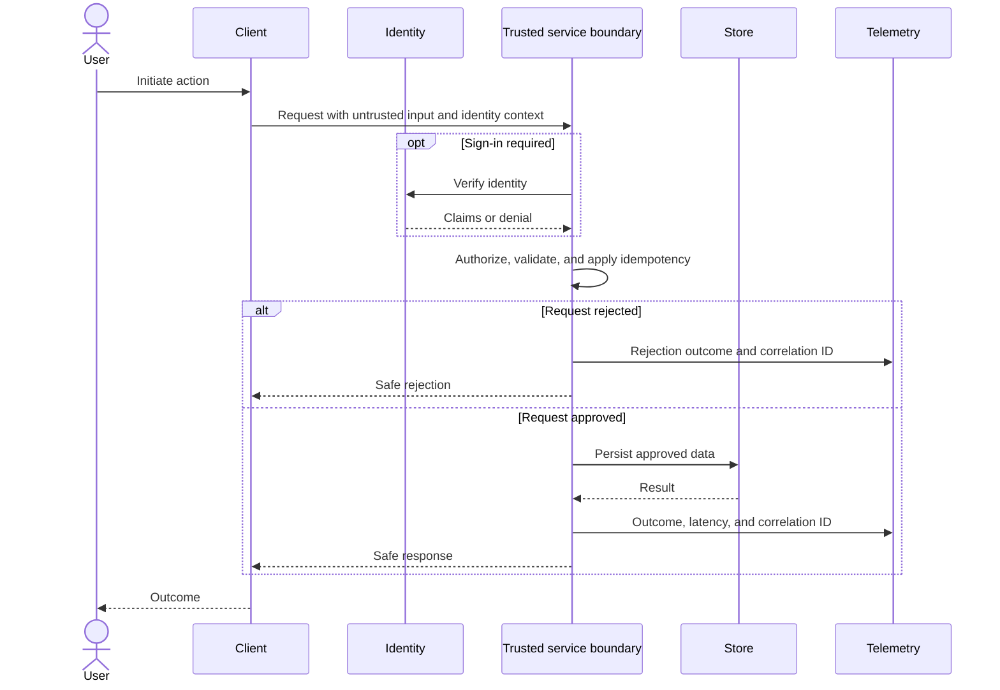
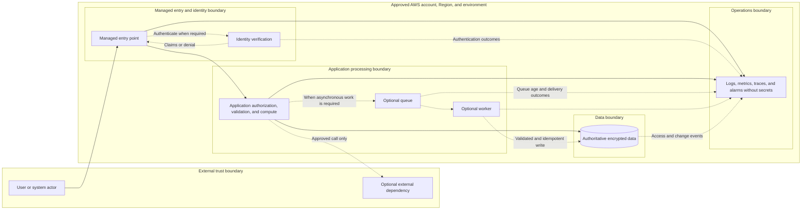
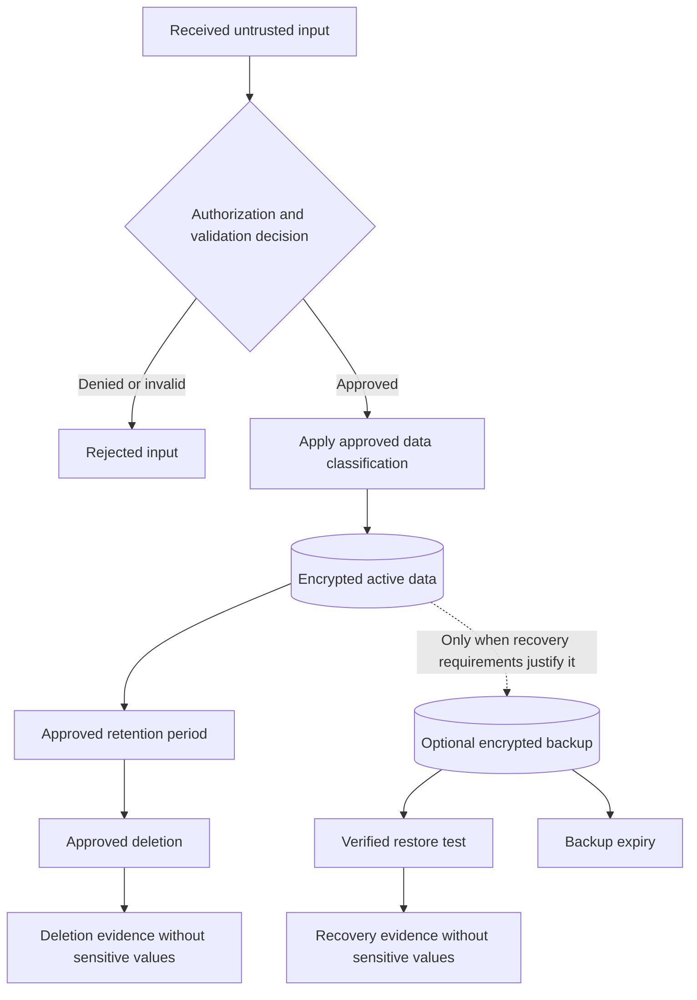
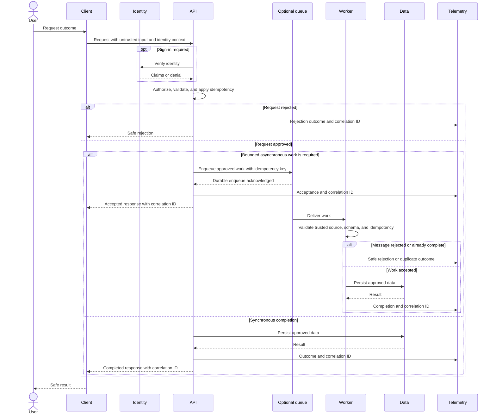
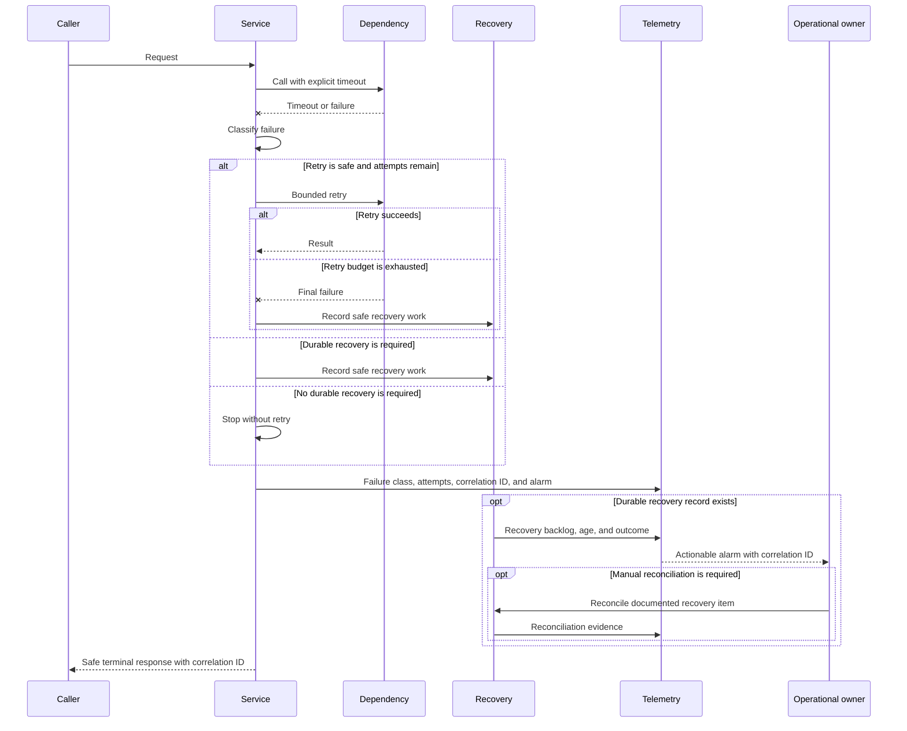

# My AWS Project — Product Requirements and Technical Design

Canonical path: `docs/project/PRD.md`.

## How to use this document

The owner does not need to complete this template alone. Codex asks short,
plain-language questions, writes the answers into Part I, and presents one
compact Gate A decision card. After Gate A, Codex completes the technical
sections and presents one Gate B decision card. Those are the only routine
human gates.

Read the owner-facing summaries and decision cards first. The detailed IDs,
tables, hashes, and receipt rules are the exact agent reference that makes the
approved work resumable and auditable.

## Agent reference — exact requirements and design record

## Document status

| Field | Value |
|---|---|
| Bootstrap release | TODO (release version and source commit/tag) |
| Workflow mode | `codex-native` |
| Project mode | `greenfield` / `brownfield` |
| Delivery profile | `quick-mvp` / `standard` / `high-risk` |
| Effective risk | `low` / `moderate` / `high` / `critical` |
| AWS lane | `documentation-only` / `read-only` / `fast-dev` / `explicit-gate` |
| Specification status | Draft |
| Current requirements revision | `REQ-0001` |
| Gate A derived status | `BLOCKED` |
| Current design revision | `DES-0001` |
| Current construction authorization ID | `AUTH-0001` |
| Gate B derived status | `BLOCKED` |
| Design status | Not started |
| Target release | TODO |
| Last reviewed | TODO |
| Primary owner | TODO |

A Quick MVP is one small, reversible development release. Use `high-risk` when
work involves production, sensitive or regulated data, payments, customer
isolation, shared infrastructure, irreversible data changes, or a potentially
large outage or cost increase. Also use it for consequential identity changes,
public exposure, multi-account or multi-Region coordination, or strict recovery
targets.

The profile changes scope and review depth; it never reduces required testing
or approval. An AWS lane describes planned access; it does not authorize a
change. AWS changes require an approved record naming the account, Region,
environment, resources, operations, cost limit, rollback plan, and expiration.

Planning starts with `MINIMIZE_TOTAL_COST; HARD_CAP_NOT_STATED` unless the owner
provides a real limit. Preserve that limit's exact ISO currency and amount as
`MINIMIZE_TOTAL_COST; HARD_CAP: <ISO_CURRENCY> <OWNER_AMOUNT>`; `USD 20.00` is
only an example and never a default or substituted value.
This is an optimization objective, not permission to spend up to a target.
Gate A records the cost posture and material constraints; a finite positive
ceiling such as `USD: 20.00` becomes mandatory before an AWS mutation or
billable deployed test. That ceiling covers the authorization-validity period,
may not exceed or change the currency of an owner hard cap, and is not a guaranteed AWS billing stop.
Required security, recovery, and evidence controls
are never traded away for a lower estimate.

Use this canonical mapping. Project lane, one prompt's access mode, and the
Gate B boundary are separate fields; do not invent synonyms.

| Project AWS lane | Prompt AWS mode | Gate B AWS boundary |
|---|---|---|
| `documentation-only` | `DOCS_ONLY` | `DOCS_ONLY` |
| `read-only` | `READ_ONLY` | `READ_ONLY` |
| `fast-dev` | `MUTATION` only after read-only preflight | `MUTATE_LISTED_RESOURCES` |
| `explicit-gate` | `DOCS_ONLY` or `READ_ONLY` | `DOCS_ONLY` or `READ_ONLY`; mutation requires a separate action-specific receipt |

`NONE` means no AWS access for the current prompt.

### Delivery profile overlays

The selected profile changes planning depth and task shape, not safety or the
number of lifecycle gates.

| Profile | Required overlay |
|---|---|
| `quick-mvp` | One thin, observable outcome; one development environment and Region where feasible; minimal independently verifiable tasks; one coordinator; explicit rollback or teardown. |
| `standard` | Intended-environment operations, integration and migration coverage, with serialized construction by one coordinator. |
| `high-risk` | Deeper review of identity, data access, customer separation, migration, recovery, rollback, shared-resource impact, audit needs, and failure handling; smaller mutation batches; stronger evidence. |

If the recorded risk is `high` or `critical`, select `high-risk`. Every profile
keeps the same identity, IAM, data, testing, evidence, cost, and change-approval
requirements, and none adds a routine owner gate beyond Gate A and Gate B.

## 1. Workload profile

| Field | Value |
|---|---|
| Workload | My AWS Project |
| Business outcome | TODO |
| Primary owner | TODO |
| Users | TODO |
| Environment | Development / staging / production |
| AWS accounts | TODO |
| Primary Region | {{AWS_REGION}} |
| Data classification | Public / internal / confidential / regulated |
| Availability target | TODO |
| Recovery target | RTO: TODO; RPO: TODO |
| Cost posture | {{COST_POSTURE}} |
| Expected traffic | TODO |
| Applicable AWS lenses | TODO |

### 1.1 Intake provenance

Keep the intake concise, but make every requirement traceable to a human or an
observed brownfield fact. After Gate A is approved, this repository is the
authoritative specification; Notion or chat remains provenance, not a competing
source of truth.

| Field | Value |
|---|---|
| Intake session ID | TODO |
| Intake source links | TODO (Notion page, issue, transcript, or `NONE`) |
| Participants and decision owner | TODO |
| Captured by | TODO |
| Captured at | TODO (ISO 8601 with timezone) |
| Last reconciled with sources | TODO (ISO 8601 with timezone) |
| Owner-stated outcome, in their words | TODO |
| Unresolved input IDs | TODO / `NONE` |
| Material source conflicts | TODO / `NONE` |

| Requirement or constraint ID | Basis | Source or evidence | Confidence | Owner confirmation |
|---|---|---|---|---|
| FR-001 | `OWNER_FACT` / `REPOSITORY_FACT` / `RECOMMENDATION` / `PROPOSED_ASSUMPTION` / `OPEN_QUESTION` | TODO | TODO | TODO |

Do not paste a second PRD into this section. Summarize the input, preserve links,
and translate agreed facts into the requirement sections below.

### 1.2 Brownfield baseline and preservation contract

This section is mandatory when project mode is `brownfield`. For `greenfield`,
set every field to `NOT_APPLICABLE` rather than silently leaving it blank.

| Field | Brownfield baseline |
|---|---|
| Repository and baseline commit | TODO |
| Deployed environments and observed versions | TODO |
| Existing architecture and ownership | TODO |
| Current interfaces, schemas, and consumers | TODO |
| Current data stores and migration constraints | TODO |
| Existing security and compliance controls | TODO |
| Baseline verification commands | TODO |
| Baseline evidence location | TODO |
| Known defects and accepted debt | TODO / `NONE_OBSERVED` |
| Repository-to-environment drift | TODO / `NONE_OBSERVED` |
| Dirty or user-owned working-tree changes | TODO / `NONE` |
| Protected files and components | TODO |
| Unresolved bootstrap overlay collisions | TODO / `NONE` |

| Preservation ID | Behavior, asset, or constraint to preserve | How it is verified before change | Allowed change | Explicitly prohibited or approval-required change |
|---|---|---|---|---|
| PRES-001 | TODO | TODO | TODO | TODO |

Unknown brownfield behavior is not permission to replace it. If the baseline
cannot be observed, record the gap as a Gate A finding and propose the smallest
safe discovery step.

For brownfield mode, every baseline fact is mandatory and must be observed or
explicitly bounded before Gate A readiness. Do not use `NONE`, `UNKNOWN`, or an
unexplained N/A for repository/baseline, deployments, architecture/ownership,
interfaces/consumers, data/migration, security controls, baseline commands,
evidence, or protected components. `NOT_APPLICABLE — <reason>` is allowed only
when observation proves the concern genuinely cannot apply. Only these fields
are nullable, using these exact forms: known defects and accepted debt
`NONE_OBSERVED`; repository-to-environment drift `NONE_OBSERVED`; dirty or
user-owned changes `NONE`; unresolved overlay collisions `NONE`.

# Part I — Requirements

## 2. Product statement

Describe the product, target user, and core value in one paragraph.

## 3. Problem and opportunity

Describe:

- the problem or deficiency;
- who experiences it;
- current impact or risk;
- why it is worth solving now.

## 4. Users and outcomes

| User or actor | Desired outcome | Guardrail |
|---|---|---|
| TODO | TODO | TODO |

## 5. Goals and non-goals

### Goals

1. TODO
2. TODO
3. TODO

### Non-goals

- TODO
- TODO

## 6. Feature specifications

### User stories

| ID | User story | Priority | Related requirements |
|---|---|---|---|
| US-001 | As a TODO, I want TODO, so that TODO. | High | FR-001 |

### Functional requirements

| ID | Requirement | EARS form | Acceptance criteria | Acceptance form |
|---|---|---|---|---|
| FR-001 | TODO | UBIQUITOUS | TODO | MEASURABLE |
| FR-002 | TODO | UNWANTED_BEHAVIOR | TODO | GHERKIN |

Normative requirement rows use one EARS form and one acceptance form. EARS
states the observable obligation; acceptance criteria state how it is verified.
Do not apply these fields to goals, stories, facts, assumptions, decisions,
architecture, tasks, tests, receipts, or evidence. Acceptance criteria must be
objective and observable. Replace undefined terms such as "fast," "secure,"
"large," or "user friendly" with measurable conditions.

## 7. Primary, alternate, and failure flows

### Primary flow

Edit this requirements-level flow in place during intake. Keep it focused on
the user-visible outcome and approved or rejected behavior; detailed component
behavior belongs in Part III.



Describe the flow in numbered steps.

### Alternate flows

- TODO

### Failure and recovery flows

- TODO

## 8. Data requirements

| ID | Requirement | EARS form | Acceptance criteria | Acceptance form |
|---|---|---|---|---|
| DATA-001 | The project SHALL identify exactly one authoritative store and accountable owner for each persistent data category. | UBIQUITOUS | A data-inventory check maps every persistent category to exactly one source of truth and one accountable owner. | MEASURABLE |
| DATA-002 | The project SHALL assign an approved classification and access boundary to each data category. | UBIQUITOUS | Access tests and configuration evidence show approved access succeeds and access outside each recorded boundary is denied. | MEASURABLE |
| DATA-003 | The project SHALL define retention, deletion, and audit-data behavior for every stored category. | UBIQUITOUS | Time-bounded tests or observed evidence demonstrate the approved retention, deletion, and audit outcomes for every stored category. | MEASURABLE |
| DATA-004 | WHERE durable recovery applies, the service SHALL restore data within the approved recovery objectives. | OPTIONAL_FEATURE | A timed restore rehearsal meets the current RTO and RPO, or the requirement records why durable recovery does not apply. | MEASURABLE |
| DATA-005 | WHILE data-bearing construction is planned, the design SHALL identify migration, compatibility, and residency constraints. | STATE_DRIVEN | A traceability check maps every applicable constraint to a validation, migration, or rollback check. | MEASURABLE |

## 9. Security and privacy requirements

| ID | Requirement | EARS form | Acceptance criteria | Acceptance form |
|---|---|---|---|---|
| SEC-001 | WHILE an operation is protected, the application SHALL permit only signed-in identities to perform it. | STATE_DRIVEN | GIVEN an approved protected operation, WHEN a signed-in or signed-out identity requests it, THEN the signed-in request succeeds and the signed-out request is denied. | GHERKIN |
| SEC-002 | The service SHALL enforce each identity's approved data and action boundary on the server. | UBIQUITOUS | Authorization tests prove approved access succeeds and unapproved access is denied at the recorded identity boundary. | MEASURABLE |
| SEC-003 | The project SHALL keep secrets outside source control, generated artifacts, and telemetry. | UBIQUITOUS | Secret scans pass and reviewed generated artifacts and logs contain zero secret values. | MEASURABLE |
| SEC-004 | IF external input violates documented shape or size limits, THEN the application SHALL reject it without creating an unintended change. | UNWANTED_BEHAVIOR | GIVEN invalid, malformed, or oversized external input, WHEN the application receives it, THEN the request is rejected and no unintended state change is recorded. | GHERKIN |
| SEC-005 | The deployment SHALL grant IAM and trust policies only the required actions on the required resources. | UBIQUITOUS | Policy checks and deployed access tests confirm required actions succeed and actions outside the approved resource boundary are denied. | MEASURABLE |
| SEC-006 | WHERE sensitive data is handled, the service SHALL use approved encryption controls in transit and at rest. | OPTIONAL_FEATURE | Infrastructure definitions and deployed configuration checks match every approved encryption control. | MEASURABLE |
| SEC-007 | WHEN an important access or change event occurs, the service SHALL record the actor, action, target, and time without recording secrets. | EVENT_DRIVEN | Audit-event tests and log review confirm all five required event conditions for every sampled event. | MEASURABLE |

Invalid, malformed, and oversized inputs are rejected without creating an
unintended change.

Remove rows that genuinely do not apply and add any workload-specific
safeguards needed for the approved users, data, and integrations. Record an
actual discovered defect in `docs/project/BUGFIX.md` or an authorized issue rather than in
generic template prose.

## 10. Reliability requirements

| ID | Requirement | EARS form | Acceptance criteria | Acceptance form |
|---|---|---|---|---|
| REL-001 | The service SHALL bound timeouts and retries to approved limits. | UBIQUITOUS | Generated failure-sequence tests never exceed the configured timeout and retry bounds. | MEASURABLE |
| REL-002 | WHEN delivery repeats work, the service SHALL produce one effective outcome. | EVENT_DRIVEN | GIVEN work that may be delivered more than once, WHEN the same work is delivered repeatedly, THEN one effective outcome is recorded. | GHERKIN |
| REL-003 | IF stale or concurrent work conflicts with newer state, THEN the service SHALL preserve the newer valid state without corruption. | UNWANTED_BEHAVIOR | Stateful concurrency property tests preserve the newer valid state across the approved generated-case bound. | MEASURABLE |
| REL-004 | WHERE durable recovery applies, the service SHALL restore within the approved RTO and RPO. | OPTIONAL_FEATURE | A timed restore rehearsal meets the approved RTO and RPO. | MEASURABLE |
| REL-005 | WHEN a release fails approved health checks, the deployment SHALL support rollback to the last known-good artifact. | EVENT_DRIVEN | A rollback rehearsal restores the bound last known-good artifact and all approved smoke tests pass. | MEASURABLE |

## 11. Performance, cost, and sustainability requirements

### Performance efficiency

| ID | Requirement | EARS form | Acceptance criteria | Acceptance form |
|---|---|---|---|---|
| PERF-001 | The project SHALL define an explicit latency target and measurement condition for each critical user path. | UBIQUITOUS | Each target names the path, percentile or bound, workload, and observable test result. | MEASURABLE |
| PERF-002 | The project SHALL define expected throughput and concurrency for each approved environment. | UBIQUITOUS | A bounded test or calculation covers the approved normal and peak workload for every environment. | MEASURABLE |
| PERF-003 | The design SHALL define scaling boundaries and resource limits. | UBIQUITOUS | Tests or configuration checks show work stays within approved limits and fails safely at each boundary. | MEASURABLE |
| PERF-004 | WHERE performance evidence is required, the project SHALL document the load-test profile. | OPTIONAL_FEATURE | The profile records data shape, duration, concurrency, environment, and pass condition, or records why performance evidence does not apply. | MEASURABLE |

### Cost optimization

| ID | Requirement | EARS form | Acceptance criteria | Acceptance form |
|---|---|---|---|---|
| COST-001 | The project SHALL use `{{COST_POSTURE}}` and minimize expected total cost and idle spend while satisfying approved security, reliability, performance, and evidence requirements. | UBIQUITOUS | The Gate A card, project state, and selected design use the same cost posture, and a traceability check finds no weakened approved requirement. | MEASURABLE |
| COST-002 | The project SHALL record any owner hard cap, budget-alert thresholds, and recipients without inventing a hard cap. | UBIQUITOUS | The record contains the owner's exact cap and alert plan, or records `HARD_CAP_NOT_STATED` or why cost alerts do not apply. | MEASURABLE |
| COST-003 | The design SHALL identify primary cost drivers, expected low-usage cost, and scaling breakpoints. | UBIQUITOUS | The design records material billing dimensions and an attributable estimate or current-source calculation. | MEASURABLE |
| COST-004 | WHEN expansion or migration is proposed, the design SHALL require a measurable approved trigger before the change. | EVENT_DRIVEN | Each proposed expansion records a bounded threshold, evidence source, and owner decision path. | MEASURABLE |
| COST-005 | The project SHALL define tagging, idle-resource handling, and teardown expectations for created resources. | UBIQUITOUS | IaC and runbook checks cover approved tags, idle policy, and teardown or retained-resource behavior. | MEASURABLE |

A hard cap is optional during requirements approval unless it is an owner-stated
business constraint. Do not manufacture one. Preserve a real cap in the Gate A
posture as `MINIMIZE_TOTAL_COST; HARD_CAP: <ISO_CURRENCY> <OWNER_AMOUNT>` using
the owner's exact currency and amount. For example, an owner-provided USD 20.00
cap becomes `MINIMIZE_TOTAL_COST; HARD_CAP: USD 20.00`. A finite positive Gate B
ceiling such as `USD: 20.00` is required before any AWS mutation or billable
deployed test, applies across that authorization's validity period, and cannot
exceed or change the currency of the Gate A cap. It is an authorization limit,
not a guaranteed provider-side billing stop. Never select a cheaper option by
weakening required identity, encryption, secrets handling, input validation,
isolation, recovery, logging, or evidence controls.

### Sustainability

| ID | Requirement | EARS form | Acceptance criteria | Acceptance form |
|---|---|---|---|---|
| SUS-001 | WHERE the approved workload does not need an idle resource, the deployment SHALL remove or scale down that resource. | OPTIONAL_FEATURE | Configuration or teardown evidence confirms the approved idle behavior for every applicable resource. | MEASURABLE |
| SUS-002 | The design SHALL avoid unnecessary data movement and retention. | UBIQUITOUS | A design review identifies material movement and retention and records a requirement basis for each retained path. | MEASURABLE |
| SUS-003 | WHEN capacity expansion is proposed, the project SHALL measure utilization before approving the expansion. | EVENT_DRIVEN | Expansion evidence cites the approved utilization trigger and an observed measurement at or above that trigger. | MEASURABLE |
| SUS-004 | WHEN learning changes an approved architecture decision, the project SHALL record the tradeoff and owner decision path. | EVENT_DRIVEN | A traceability check links the affected requirement and design IDs, evidence, and owner decision. | MEASURABLE |

## 12. Operational requirements

| ID | Requirement | EARS form | Acceptance criteria | Acceptance form |
|---|---|---|---|---|
| OPS-001 | The deployment SHALL define infrastructure and environments reproducibly through the approved IaC boundary. | UBIQUITOUS | IaC validation and environment-specific configuration checks pass for every approved environment. | MEASURABLE |
| OPS-002 | WHILE deployment is planned, the project SHALL define the deployment strategy and stop conditions. | STATE_DRIVEN | The runbook check confirms the artifact, order, health checks, failure boundary, and authorized next action are explicit. | MEASURABLE |
| OPS-003 | The service SHALL provide approved logs, metrics, dashboards, and alarms without exposing secrets. | UBIQUITOUS | Evidence checks confirm required signals, thresholds, destinations, and zero secret values in sampled content. | MEASURABLE |
| OPS-004 | The project SHALL identify incident ownership and an actionable escalation path. | UBIQUITOUS | The runbook check identifies one responsible owner and one actionable escalation path for each material incident class. | MEASURABLE |
| OPS-005 | The project SHALL define testable rollback and teardown behavior. | UBIQUITOUS | Rehearsal or observed evidence covers rollback, retained resources, and the approved teardown result. | MEASURABLE |

### Quality attribute scenarios

Use `QAS-*` only when performance, availability, reliability, recovery,
scalability, security-response, or operational-response materially affects Gate
A or architecture. Otherwise replace the row with
`NOT_APPLICABLE — <concrete reason>`.

| QAS ID | Requirement IDs | Source | Stimulus | Environment | Artifact | Response | Response measure |
|---|---|---|---|---|---|---|---|
| QAS-001 | TODO | TODO | TODO | TODO | TODO | TODO | TODO |

# Part II — Requirements Analysis and Gate A

## 13. Cross-requirement analysis

Codex must analyze the requirements as one system before completing Part III.
It may identify and propose assumptions, but it may never accept an assumption,
approve Gate A, or write an owner's authorization receipt on the owner's behalf.

### Findings

| ID | Type | Requirements involved | Finding | Resolution or decision | Blocking? | Status |
|---|---|---|---|---|---|---|
| RA-001 | Ambiguity | TODO | TODO | TODO | Yes | Open |

Valid types:

- Logical inconsistency
- Ambiguity
- Conflicting constraint
- Unstated assumption
- Missing edge case
- Missing failure behavior
- Missing concurrency behavior
- Unverifiable requirement
- Security or privacy gap
- Cost or operational gap

### Proposed assumptions

| ID | Proposed assumption | Why needed | Risk if wrong | Validation plan | Required to proceed? |
|---|---|---|---|---|---|
| ASM-001 | TODO | TODO | TODO | TODO | Yes |

Every assumption remains `PROPOSED` unless its ID is explicitly listed in the
owner acceptance record below. Silence, a prior similar decision, or an agent
recommendation is not acceptance.

### Open decisions

| ID | Decision needed | Options | Decision owner | Blocking? | Resolution |
|---|---|---|---|---|---|
| DEC-001 | TODO | TODO | TODO | Yes | TODO |

### Gate A — agent analysis record

| Field | Agent-recorded value |
|---|---|
| Requirements revision analyzed | TODO |
| Reviewed commit (optional) | TODO / `NOT_RECORDED` |
| Analysis performed by | TODO |
| Analysis completed at | TODO (ISO 8601 with timezone) |
| Open blocking finding IDs | TODO / `NONE` |
| Proposed assumption IDs required to proceed | TODO / `NONE` |
| Open blocking decision IDs | TODO / `NONE` |
| Agent recommendation | `BLOCKED` / `READY_WITH_PROPOSED_ASSUMPTIONS` / `READY_FOR_OWNER_APPROVAL` |
| Recommendation rationale | TODO |

The agent recommendation is advisory. It is not Gate A authorization.

### Gate A — readiness card

This card is the compact owner decision surface. Every value must be explicit
and trace to the current requirements revision. `NOT_APPLICABLE — <reason>` is
allowed only when the concern genuinely cannot apply; blank values, `TODO`,
`TBD`, `UNKNOWN`, and bare `NONE` are not ready.

| Field | Current requirements decision basis |
|---|---|
| Outcome | TODO |
| Owner and users | TODO |
| Scope and non-goals | TODO |
| Measurable requirement/acceptance IDs | TODO |
| Data boundary | TODO |
| Identity/security boundary | TODO |
| Environment/Region | TODO |
| Failure/recovery | TODO |
| Cost posture | TODO (exactly `MINIMIZE_TOTAL_COST; HARD_CAP_NOT_STATED` or the owner's `MINIMIZE_TOTAL_COST; HARD_CAP: <ISO_CURRENCY> <OWNER_AMOUNT>`; `USD 20.00` is only an example) |
| Intake provenance | TODO |

When the recommendation becomes `READY_WITH_PROPOSED_ASSUMPTIONS` or
`READY_FOR_OWNER_APPROVAL`, set the detailed owner state and Document status to
`PENDING_OWNER_APPROVAL` in the same checkpoint. Mirror the exact lifecycle
state in `bootstrap.yaml` and the identity/Gate B state in docs/project/TASKS.md's Active
execution snapshot. Gate B remains `BLOCKED` on a new project or becomes
`STALE` when an earlier design was invalidated. Do not leave a ready Gate A in
`BLOCKED` state. Reset the owner decision to `PENDING`, clear prior approval
identity/provenance/authorized-revision fields, and replace the old marked
receipt with the current proposed card; an earlier receipt never carries across
a requirements revision.

### Gate A — owner acceptance record

| Field | Owner-provided value |
|---|---|
| Approver | TODO |
| Owner decision | `PENDING` / `CHANGES_REQUESTED` / `APPROVED` / `STALE` |
| Authorized requirements revision | TODO |
| Authorized cost posture | TODO (must exactly match the approved Gate A readiness card) |
| Explicitly accepted assumption IDs | TODO / `NONE` |
| Explicitly rejected assumption IDs and resolution | TODO / `NONE` |
| Authorization provided at | TODO (ISO 8601 with timezone) |
| Authorization source | TODO (message, issue, meeting record, or commit link) |
| Verbatim owner receipt | `RECORDED_BELOW` / `TODO` |
| Derived Gate A state | `BLOCKED` / `PENDING_OWNER_APPROVAL` / `APPROVED_FOR_DESIGN` / `STALE` |

For approval, the owner receipt must use this human-readable form with actual
values substituted:

<!-- bootstrap:gate-a-receipt:start -->
```text
APPROVE REQUIREMENTS GATE A
Requirements revision: <REQ-nnnn>
Cost posture: <exact-Gate-A-cost-posture>
Accepted assumptions: <assumption-IDs-or-NONE>
Approver: <name/handle>
```
<!-- bootstrap:gate-a-receipt:end -->

Codex may ask for this receipt and record it verbatim after it is supplied. It
must not compose, infer, or mark the receipt approved for the owner.
For both human gates, `Approver` must identify the human decision owner. Values
such as `Codex`, `agent`, `automation`, `system`, `AI`, or another service or
model identity are invalid regardless of capitalization.

### Gate A validation and invalidation rules

The requirements revision is a monotonic ID (`REQ-0001`, `REQ-0002`, and so on).
It covers the workflow, project mode, delivery profile, effective risk, AWS lane,
workload profile, intake provenance, brownfield contract, Parts I and II findings,
proposed assumptions, and open decisions.

Gate A is valid only when all of the following are true:

1. The current requirements revision is populated.
2. The agent analyzed that exact revision.
3. Every Gate A readiness-card field is explicit under the card grammar.
4. No finding or decision marked blocking remains open.
5. The agent recommendation is `READY_WITH_PROPOSED_ASSUMPTIONS` or
   `READY_FOR_OWNER_APPROVAL`.
6. The owner decision is `APPROVED` for that exact revision and exact cost
   posture. The receipt, owner record, readiness card, and `bootstrap.yaml` must
   all contain the same normalized cost posture.
7. Every proposed assumption required to proceed is explicitly accepted by ID,
   or the requirement is revised so that the assumption is no longer needed.
8. The authorization source and verbatim owner receipt are present and agree
   with the structured fields.

The accepted-assumption value must exactly equal the ordered assumption list on
the proposed Gate A card (or `NONE`); a subset, superset, reordered list, or
unlisted ID is invalid. At receipt ingestion, record the observed ISO 8601 time
and exact message, issue, or meeting-record source. Those are structured
provenance, not additional receipt lines, and must not be invented.

Any material change to the covered content increments the requirements revision
and immediately makes **both Gate A and Gate B stale**.
Changing a finding, proposed assumption, blocking classification, or decision
after approval also makes Gate A and Gate B stale until the owner approves a
new requirements revision that incorporates the resolution. Status, timestamp,
and receipt-recording edits do not increment the revision.

If a task plan exists, reconcile every IN_PROGRESS task and commit the stopped
ledger before setting Task-plan state to `STALE`. No old task becomes runnable
under the new revision. TASK-10 archives the stale graph by commit and replaces
it only after the new Gate B is current.

# Part III — Technical Architecture and Implementation Approach

Complete this part only after Gate A is valid.

### Technical design revision record

| Field | Value |
|---|---|
| Current design revision | `DES-0001` |
| Requirements revision designed | TODO |
| Reviewed commit (optional) | TODO / `NOT_RECORDED` |
| Design prepared by | TODO |
| Design completed at | TODO (ISO 8601 with timezone) |
| Remaining design gaps | TODO / `NONE` |

The design revision is monotonic (`DES-0001`, `DES-0002`, and so on), covers
Parts III and IV, and identifies the exact Gate A-approved requirements revision
it implements.

### Technology and toolchain decision register

This is the authoritative register for build-relevant technology, framework,
toolchain, and version-policy choices. Use stable monotonic IDs (`TECH-0001`,
`TECH-0002`, and so on); never renumber or reuse an ID. The current `DES-*`
revision owns the selected rows. A task copies only its applicable IDs into the
existing `Design` value as `DES-0001; TECH: TECH-0001, TECH-0002` or
`DES-0001; TECH: NONE — no technology/toolchain impact`; it does not select or
substitute a technology.

Resolve every in-scope row before Gate B. `Version policy` is exactly one of
`EXACT: <version>`, `COMPATIBLE_MAJOR: <positive integer>`,
`MINIMUM: <version>`, `CURRENT_LTS_AS_OF: <YYYY-MM-DD>`,
`ORG_MANAGED: <constraint>`, or `NOT_APPLICABLE — <reason>`. `Source` is exactly
`OWNER_CONSTRAINT`, `REPOSITORY_FACT`, or `AGENT_RECOMMENDATION`; `Basis IDs`
are exact comma-space-separated stable IDs that already exist in the current
accepted PRD. They may reference requirements, design decisions, properties,
or constraints, but never prose, duplicate IDs, the row's own `TECH-*` ID, or
an obsolete revision. `Validation` names the objective check or narrowly scoped
ADR. AWS Core evidence
may inform and be bound to a `TECH-*` row and the current `DES-*`, but it remains
advisory. The official AWS Core policy is
`OFFICIAL_CURRENT_NO_TEMPLATE_PIN`; its observed version is evidence metadata,
never a project pin.

`EXACT` may use an opaque ecosystem version such as `nodejs20.x`. `MINIMUM`
uses a machine-comparable numeric dotted version such as `6.0`; use another
policy when the ecosystem version cannot be ordered numerically.
An active `PROPERTY_TESTING` decision must use `EXACT`, `COMPATIBLE_MAJOR`, or
numeric `MINIMUM` so observed property-test evidence can prove the approved
version policy. `CURRENT_LTS_AS_OF` and `ORG_MANAGED` remain valid for other
technology concerns but cannot back a property execution row.

`Selection` names the chosen technology or uses exactly
`NOT_APPLICABLE — <reason>` when no technology applies. In that case, `Version
policy` must use the same non-applicable grammar.

| Decision ID | Concern | Selection | Version policy | Source | Basis IDs | Alternatives and rationale | Compatibility/migration | Validation |
|---|---|---|---|---|---|---|---|---|
| TECH-0001 | APPLICATION_RUNTIME | TODO | TODO | TODO | TODO | TODO | TODO | TODO |
| TECH-0002 | APPLICATION_FRAMEWORK | TODO | TODO | TODO | TODO | TODO | TODO | TODO |
| TECH-0003 | FRONTEND_FRAMEWORK | TODO | TODO | TODO | TODO | TODO | TODO | TODO |
| TECH-0004 | INFRASTRUCTURE_AS_CODE | TODO | TODO | TODO | TODO | TODO | TODO | TODO |
| TECH-0005 | PACKAGE_BUILD_TOOLING | TODO | TODO | TODO | TODO | TODO | TODO | TODO |
| TECH-0006 | TEST_TOOLING | TODO | TODO | TODO | TODO | TODO | TODO | TODO |
| TECH-0007 | PROPERTY_TESTING | TODO | TODO | TODO | TODO | TODO | TODO | TODO |
| TECH-0008 | SECURITY_VALIDATION | TODO | TODO | TODO | TODO | TODO | TODO | TODO |
| TECH-0009 | DEPLOYMENT_TOOLING | TODO | TODO | TODO | TODO | TODO | TODO | TODO |

### Architecture drivers

Record only Gate A-approved requirement IDs. `Class` is exactly
`HARD_CONSTRAINT`, `PREFERENCE`, or `REVISIT_TRIGGER`; a preference never
overrides a hard constraint.

| Driver ID | Requirement basis | Class | Decision implication | Validation |
|---|---|---|---|---|
| DRV-0001 | TODO | TODO | TODO | TODO |

### Whole-system candidates

Compare complete, credible designs with the same requirements. For greenfield
work, one candidate summary begins `MANAGED_SERVERLESS_BASELINE:` unless a
Gate A hard constraint makes that baseline impossible. Do not create a weak
straw candidate or use arbitrary numeric scoring. `Eligibility` is exactly
`ELIGIBLE` or `INELIGIBLE`; an eligible candidate has `Failed constraints`
`NONE`, while an ineligible candidate names only failed `HARD_CONSTRAINT`
driver IDs.

| Candidate ID | Architecture summary | Requirement coverage | AWS evidence | Eligibility | Failed constraints | Tradeoffs |
|---|---|---|---|---|---|---|
| CAND-0001 | TODO | TODO | TODO | TODO | TODO | TODO |

### Selected architecture

Select exactly one eligible candidate. The selection is an
`AGENT_RECOMMENDATION` until Gate B. If only one candidate is eligible,
`Rejected alternatives` may be `NO_VIABLE_ALTERNATIVE`; otherwise enumerate
every nonselected `CAND-*` in table order.

| Architecture ID | Selected candidate | Requirement and driver basis | Rationale | Rejected alternatives | Risks | Mitigations | Cost effect | Breakpoints | Revisit triggers | Validation |
|---|---|---|---|---|---|---|---|---|---|---|
| ARCH-0001 | TODO | TODO | TODO | TODO | TODO | TODO | TODO | TODO | TODO | TODO |

### Architecture traceability

Map each current requirement exactly once to the selected `ARCH-*` and at
least one concrete component, API, data, or control ID. Use exact property or
test IDs when applicable; otherwise use `NONE - <concrete reason>`.

| Requirement ID | ARCH / COMP / API / DATA / CTRL IDs | Property/test IDs | Evidence IDs |
|---|---|---|---|
| TODO | TODO | TODO | TODO |

### Material AWS evidence

This table maps design decisions to current official AWS facts. The detailed,
attributable `retrieve_skill` and `search_documentation` call evidence remains
authoritative in `docs/project/VERIFY.md`; this PRD table does not duplicate
tool transcripts or prove invocation by itself.

| Evidence ID | Design IDs | Material claim | AWS Core capability | Official reference | Observed date |
|---|---|---|---|---|---|
| AWS-EV-0001 | TODO | TODO | `retrieve_skill` | TODO | TODO |
| AWS-EV-0002 | TODO | TODO | `search_documentation` | TODO | TODO |

A material change to an architecture driver, candidate eligibility, selected
architecture, traceability row, material AWS evidence, technology selection,
version policy, compatibility constraint, property applicability, property
definition, or property execution value
requires a new `DES-*` revision and makes the prior Gate B approval stale. An
ordinary dependency addition does not invalidate Gate B unless it changes
architecture, validation, security, cost, or deployment behavior.

## 14. Architecture overview

For a greenfield application, evaluate a secure managed serverless baseline
first. Prefer the smallest pay-per-use design that meets the requirements,
minimizes idle infrastructure and operational burden, and preserves clear
identity, data, failure, and observability boundaries. This is a design
hypothesis, not a mandate. Record why a non-serverless option is better when
current AWS evidence shows a material latency, sustained-utilization, service
limit, networking, compliance, portability, or total-cost advantage. Define
measurable expansion triggers instead of provisioning future capacity early.

The Mermaid blocks in Parts III and IV are editable starter patterns, not
claims about the finished system. During `DESIGN-10`, update the existing
blocks in place: replace generic roles with selected components, remove unused
optional paths, and keep the diagrams consistent with the written design. Do
not append another diagram by default. If a path is not applicable, remove it
and record the reason beside the existing diagram. A diagram records intended
design; implementation and deployment proof belongs in code, IaC, tests, and
`docs/project/VERIFY.md`.

Architecture basis for every Mermaid view: TODO (replace with the selected
`ARCH-*` during `DESIGN-10`).



Describe:

- major components;
- trust boundaries;
- public and private network boundaries;
- identity boundaries;
- data movement;
- external dependencies;
- failure boundaries.

## 15. Component design

| Component | Responsibility | Inputs | Outputs | Dependencies | Failure behavior | Owner |
|---|---|---|---|---|---|---|
| TODO | TODO | TODO | TODO | TODO | TODO | TODO |

## 16. Interfaces and contracts

| Contract ID | Producer | Consumer | Schema or protocol | Authentication | Versioning | Idempotency |
|---|---|---|---|---|---|---|
| API-001 | TODO | TODO | TODO | TODO | TODO | TODO |

Put executable schemas in code. This section owns the architectural contract, not duplicate field-by-field definitions already enforced by schemas.

## 17. Data model and lifecycle



Define:

- entities and ownership;
- keys and indexes;
- consistency needs;
- transaction boundaries;
- retention;
- backup and restore;
- deletion semantics;
- concurrency controls.

## 18. Detailed sequence diagrams

### Sequence — primary outcome



### Sequence — failure and recovery



Edit these sequence diagrams in place for the selected workload. Remove unused
participants and branches. Add another sequence only when the existing primary
and failure slots cannot accurately represent a materially different flow and
the owner explicitly requests the additional diagram.

## 19. Error handling strategy

| Error class | Example | Retry? | User-visible behavior | Logging or metric | Recovery |
|---|---|---|---|---|---|
| Validation | TODO | No | Safe 4xx or equivalent | Counter without sensitive input | User corrects request |
| Transient dependency | TODO | Bounded | Safe temporary failure | Error metric and correlation ID | Retry or queue |
| Permanent dependency | TODO | No | Reviewable terminal state | Alarm | Manual remediation |
| Concurrency conflict | TODO | No or retry with fresh state | Conflict response | Conflict metric | Re-read and retry |
| Internal defect | TODO | No uncontrolled retry | Generic safe error | Alert and trace | Rollback or fix |

Define error taxonomy, safe messages, correlation IDs, retry ownership, timeout ownership, dead-letter behavior, and operator actions.

## 20. AWS implementation approach

| Concern | Decision IDs | AWS service or mechanism | Rationale | Tradeoff |
|---|---|---|---|---|
| Compute | TODO | TODO | TODO | TODO |
| Identity | TODO | TODO | TODO | TODO |
| Data | TODO | TODO | TODO | TODO |
| Messaging or orchestration | TODO | TODO | TODO | TODO |
| Networking | TODO | TODO | TODO | TODO |
| Observability | TODO | TODO | TODO | TODO |
| Deployment | TODO | TODO | TODO | TODO |
| Secrets and encryption | TODO | TODO | TODO | TODO |

Reference the authoritative `TECH-*` rows in the `Decision IDs` column; do not
restate or override their selections or version policies here.

Use the installed `aws-core` plugin from Agent Toolkit for AWS and current AWS
primary documentation when completing this section. Compare the secure
serverless baseline with any proposed alternative using workload fit, required
controls, expected low-usage cost, scaling breakpoints, operational ownership,
and migration or expansion triggers. Cost never overrides a required security
or recovery control.

### Lightweight Well-Architected decision review

Keep this a short, blame-free design conversation, not a separate audit or
gate. Record the applicable Operational Excellence, Security, Reliability,
Performance Efficiency, Cost Optimization, and Sustainability effects in the
existing design and task records. Reversible low-risk choices need only concise
rationale. Expand evidence, alternatives, rollback, and owner visibility when
effective risk is high/critical or a decision is a one-way door that would be
difficult, costly, or unsafe to reverse.

## 21. Implementation boundaries and order

- Existing components to reuse: TODO
- Components to modify: TODO
- Components to add: TODO
- Compatibility constraints: TODO
- Migration approach: TODO
- Feature flags or staged rollout: TODO
- Rollback boundary: TODO
- Explicitly deferred work: TODO

`docs/project/TASKS.md` will translate this design into discrete executable tasks.

# Part IV — Testing Strategy

## 22. Test layers

| Layer | Purpose | Required coverage |
|---|---|---|
| Static | Formatting, linting, typing, schemas, IaC | TODO |
| Unit | Isolated rules and functions | TODO |
| Integration | Data stores, queues, identity, APIs, contracts | TODO |
| End-to-end | Complete user outcomes | TODO |
| Security | Authentication, authorization, abuse, secrets | TODO |
| Reliability | Retry, timeout, idempotency, concurrency, recovery | TODO |
| Performance | Latency, throughput, saturation, scaling | TODO |
| AWS environment | Deployed configuration and service behavior | TODO |
| Operations | Deployment, alarms, rollback, restore, teardown | TODO |

### Gate B Harness Profile

Select the smallest closed-loop checks justified by the current design. Derive
the profile from the selected `TECH-*` register, delivery profile, effective
risk, data classification, identity boundary, public exposure, recovery
target, and AWS lane. A tool is never required merely because it exists, and
Fastlane does not impose a universal scanner.

Use exactly one status per row:

- `REQUIRED`;
- `CONDITIONAL — <trigger>`; or
- `NOT_APPLICABLE — <concrete reason>`.

A conditional row becomes required when its recorded trigger is present. For
an inapplicable row, use `NOT_APPLICABLE` for the selected check, command/API,
and evidence destination while the status records the concrete reason. At Gate
B, every applicable row has a stable `HARNESS-*` ID, current basis IDs, one
exact command or API, and an existing `docs/project/VERIFY.md` destination.

| Harness ID | Layer | Selected check or tool | Trigger | Basis IDs | Exact command or API | Evidence destination | Required or conditional status |
|---|---|---|---|---|---|---|---|
| HARNESS-001 | Static | TODO | TODO | TODO | TODO | `docs/project/VERIFY.md` Harness execution evidence | TODO |
| HARNESS-002 | Unit | TODO | TODO | TODO | TODO | `docs/project/VERIFY.md` Harness execution evidence | TODO |
| HARNESS-003 | Integration | TODO | TODO | TODO | TODO | `docs/project/VERIFY.md` Harness execution evidence | TODO |
| HARNESS-004 | End-to-end | TODO | TODO | TODO | TODO | `docs/project/VERIFY.md` Harness execution evidence | TODO |
| HARNESS-005 | Property | TODO | TODO | TODO | TODO | `docs/project/VERIFY.md` Harness execution evidence | TODO |
| HARNESS-006 | Security and privacy | TODO | TODO | TODO | TODO | `docs/project/VERIFY.md` Harness execution evidence | TODO |
| HARNESS-007 | Reliability and recovery | TODO | TODO | TODO | TODO | `docs/project/VERIFY.md` Harness execution evidence | TODO |
| HARNESS-008 | Performance and scalability | TODO | TODO | TODO | TODO | `docs/project/VERIFY.md` Harness execution evidence | TODO |
| HARNESS-009 | IaC and policy | TODO | TODO | TODO | TODO | `docs/project/VERIFY.md` Harness execution evidence | TODO |
| HARNESS-010 | AWS environment and operations | TODO | TODO | TODO | TODO | `docs/project/VERIFY.md` Harness execution evidence | TODO |

TASK-10 copies every required or triggered conditional row into the existing
task Validation sections without adding task metadata. BUILD records observed
results in the named evidence destination. A failed check stays visible until
a later run passes; a requirement or design change returns to its existing
gate instead of weakening the check.

### IaC and delivery validation contract

Select validation from the approved `INFRASTRUCTURE_AS_CODE`,
`SECURITY_VALIDATION`, and `DEPLOYMENT_TOOLING` `TECH-*` rows; do not impose a
universal scanner. Mark unused paths `NOT_APPLICABLE — <reason>`.

| Validation path | Applicability | TECH binding | Required local/static validation | AWS planning validation | Evidence destination |
|---|---|---|---|---|---|
| CloudFormation / SAM / CDK | TODO | TODO | Synth or template validation, selected lint, and selected Guard or policy checks | Review an authorized existing change set; creating one is an AWS mutation | `docs/project/VERIFY.md` IaC validation evidence |
| Terraform | TODO | TODO | Formatting, validation, selected policy checks, and a deterministic plan boundary | Bind the reviewed plan to exact inputs, state/refresh mode, target, and digest | `docs/project/VERIFY.md` IaC validation evidence |
| Container delivery | TODO | TODO | Dependency/lock validation, SBOM generation, and selected image/configuration checks | Bind the immutable image digest and deployment target | `docs/project/VERIFY.md` IaC validation evidence |
| Other approved delivery path | TODO | TODO | Exact equivalent checks selected by current TECH decisions | Exact equivalent immutable plan and target binding | `docs/project/VERIFY.md` IaC validation evidence |

CloudFormation `CreateChangeSet` creates account-side state, including a
`REVIEW_IN_PROGRESS` stack for a new-stack change set, so it requires exact AWS
mutation authority even though `ExecuteChangeSet` is a separate operation.
Record both operations separately when both are allowed. An authenticated IAM
Access Analyzer `ValidatePolicy` call belongs only to AWS-10 after Gate B under
the named read-only scope. Local checks and unauthenticated documentation do not
substitute for either observation.

## 23. Example-based scenarios

| Test ID | Scenario | Expected result | Layer |
|---|---|---|---|
| EX-001 | Known happy path | TODO | Integration |
| EX-002 | Known boundary or failure | TODO | Unit |

## 24. Property-based testing specification

During DESIGN-10, classify every measurable Gate A requirement in the approved
revision exactly once. Use `APPLICABLE` only when a generated input or state
space and a stable oracle can test an invariant; otherwise record
`NOT_APPLICABLE` with a concrete reason.
Property-based testing is optional until an invariant is classified as
applicable. Every approved `PROP-*` is then required construction and release
evidence unless a later owner-approved requirements or design revision removes
or replaces it.

Every applicable property definition must contain concrete inputs, conditions,
oracle, boundaries, and layer. `NONE`, `PENDING`, `PLACEHOLDER`, and similar
sentinels are not definitions.

| Requirement ID | Applicability | Reason or property IDs |
|---|---|---|
| TODO | `APPLICABLE` / `NOT_APPLICABLE` | TODO |

| Property ID | Requirement IDs | Invariant | Generated inputs or state | Preconditions | Oracle | Boundary or shrink focus | Layer |
|---|---|---|---|---|---|---|---|
| PROP-001 | SEC-002 | An actor never observes another actor's protected resource. | Actors, resources, roles, identifiers | Valid authenticated actors | Access allowed only when policy relation holds | Cross-tenant IDs, missing ownership, role changes | Integration |
| PROP-002 | REL-002 | Repeating the same event produces one effective state transition. | Duplicate counts, orderings, retry timing | Same idempotency identity | Final state and side effects equal one delivery | Reordered and repeated events | Integration |
| PROP-003 | SEC-003 | No generated secret appears in emitted telemetry. | Secret-like values and payload positions | Telemetry enabled | Search of logs/events contains no secret | Unicode, long values, encoded forms | Unit / integration |
| PROP-004 | REL-001 | Retry attempts never exceed the configured bound. | Failure sequences and transient/permanent classifications | Dependency fails | Attempts <= configured maximum | Zero, one, maximum, permanent transition | Unit |
| PROP-005 | TODO | TODO | TODO | TODO | TODO | TODO | TODO |

### Property execution contract

Before Gate B, add one row for every applicable `PROP-*`. This register plans
execution; it never records an observed pass or failure. The framework must
reference the selected `PROPERTY_TESTING` decision (`TECH-0007` in this
template). `Run target/time bound` is exactly `MIN_CASES: <positive integer>`,
`MAX_SECONDS: <positive integer>`, or `MIN_CASES: <positive integer>;
MAX_SECONDS: <positive integer>` in that order. The exact command, target,
seed/reproduction format, and evidence destination are copied unchanged into
tasks. Observed versions, commands, run amounts, replay data, counterexamples,
and results belong only in `docs/project/VERIFY.md`.

Every execution cell must be concrete. The exact command is one runnable local
command, not prose, a shell-control chain, `NONE`, `PENDING`, or another
placeholder.

The replay format must explicitly declare either a seed (for example,
`integer seed; reproduce with the recorded --seed value`) or the exact command
as the replay method. Evidence then records a concrete seed such as
`seed: 12345`, or repeats the exact approved command. Vague values such as
`seed unavailable` cannot satisfy DONE.

| Property ID | Framework TECH ID | Exact command | Run target/time bound | Seed or reproduction format | Evidence destination |
|---|---|---|---|---|---|
| PROP-001 | TODO | TODO | TODO | TODO | TODO |

Add workload-specific properties for:

- round-trip serialization;
- parser acceptance and rejection;
- state-machine transitions;
- ordering and concurrency;
- financial calculations;
- resource-name generation;
- retention and expiry;
- access-control matrices;
- redaction;
- pagination;
- migrations.

When a property test finds a counterexample, preserve its seed, reproduction
command, and minimized case when the framework supplies one. Classify the
failure as one of:

- `IMPLEMENTATION_DEFECT`;
- `SPECIFICATION_AMBIGUITY_OR_DEFECT`;
- `GENERATOR_OR_ORACLE_DEFECT`; or
- `ENVIRONMENT_DEFECT`.

Never change an approved property merely to make a valid counterexample pass.

## 25. Test data and environments

- Synthetic fixture strategy: TODO
- Generated data constraints: TODO
- Sensitive-data prohibition: TODO
- Local emulation or mocks: TODO
- AWS test environment: TODO
- Cleanup strategy: TODO
- Cost limit for billable deployed tests: TODO / `NOT_APPLICABLE — local or documentation-only validation`

## 26. Release acceptance

Release is acceptable when:

- primary, alternate, and failure flows work;
- requirements-analysis blockers are resolved;
- architecture and interfaces are implemented as approved;
- required example and property-based tests pass;
- security and reliability evidence passes;
- deployment, monitoring, rollback, recovery, and cleanup are verified;
- `docs/project/VERIFY.md` records the exact release decision and remaining gaps.

The release lifecycle is `NOT_READY` -> `READY_TO_DEPLOY` ->
`RELEASE_VERIFIED`. RELEASE-10 is the only prompt that changes this state.
AWS-10 starts only from READY_TO_DEPLOY, and AWS-30 returns observed evidence to
RELEASE-10 for the final decision.

# Part V — Gate B: PRD and Construction Authorization

Gate B approves the complete PRD and a bounded construction run. It does not
grant authority outside the envelope below. Codex may recommend approval, but
only the decision owner may approve this gate.

Gate B readiness requires a local Git repository and a resolvable baseline
commit. For greenfield work, create the reviewed bootstrap baseline only under
explicit local-Git setup authorization. For brownfield work, preserve the
observed repository baseline and separately list every protected dirty path.
Remote creation, push, and GitHub writes remain separately bounded.

## 27. Gate B agent review record

| Field | Agent-recorded value |
|---|---|
| Requirements revision reviewed | TODO |
| Design revision reviewed | TODO |
| Construction authorization ID reviewed | TODO |
| Construction envelope SHA-256 reviewed | TODO (`sha256:` plus 64 lowercase hex characters) |
| Reviewed commit (optional) | TODO / `NOT_RECORDED` |
| PRD completeness gaps | TODO / `NONE` |
| Requirement-to-design-and-test traceability gaps | TODO / `NONE` |
| Unresolved risk or preservation gaps | TODO / `NONE` |
| Review completed by and at | TODO (identity and ISO 8601 time) |
| Agent recommendation | `BLOCKED` / `READY_FOR_CONSTRUCTION_APPROVAL` |
| Recommendation rationale | TODO |

### Gate B — readiness card

Every field summarizes the current design and complete construction envelope.
Use explicit values and stable IDs. `NOT_APPLICABLE — <reason>` is allowed only
when genuinely inapplicable; blank values, `TODO`, `TBD`, and `UNKNOWN` are not
ready. `Outstanding gaps` must be `NONE` or a comma-separated list of stable
gap IDs; any listed gap keeps the recommendation `BLOCKED`.

`Validation/evidence` cites every current required or triggered conditional
`HARNESS-*` ID. A Harness Profile row that is incomplete, unjustified, or not
bound to a current basis ID keeps Gate B blocked.

| Field | Current design and construction decision basis |
|---|---|
| Design basis IDs | TODO |
| Architecture/components | TODO |
| Technology/toolchains/version policy | TODO |
| Interfaces/data flow | TODO |
| Identity/secrets | TODO |
| Failure/retry/concurrency | TODO |
| Deployment/operations | TODO |
| Validation/evidence | TODO (cite required and triggered conditional `HARNESS-*` IDs) |
| Rollback/recovery/teardown | TODO |
| Brownfield compatibility/migration | TODO |
| Outstanding gaps | TODO / `NONE` |

## 28. Construction envelope

Use explicit values; `reasonable`, `as needed`, and blank cells grant no
authority. `NONE` means prohibited or empty only where the row grammar allows
it, never undecided.

| Boundary | Authorized value |
|---|---|
| Construction authorization ID | `AUTH-0001` |
| Project mode | `greenfield` / `brownfield` |
| Delivery profile and effective risk | `<profile> / <risk>` |
| Project AWS lane | `documentation-only` / `read-only` / `fast-dev` / `explicit-gate` |
| Authorized outcome | TODO |
| Authorized requirement and design IDs | `REQ: REQ-0001; DES: DES-0001; SCOPE_IDS: FR-001, SEC-001, ARCH-0001, TECH-0001, TECH-0002, TECH-0003, TECH-0004, TECH-0005, TECH-0006, TECH-0007, TECH-0008, TECH-0009, PROP-001, HARNESS-001` |
| Design contract SHA-256 | TODO (exact current `design_contract.canonical_sha256`) |
| Authorized baseline commit | TODO (full Git commit hash) |
| Protected dirty paths | `NONE` / `PATHS: path; path` |
| In-scope components and environments | TODO |
| Allowed repository write set | `PATHS: exact/path; narrow/**` |
| Excluded or owner-only write set | `NONE` / `PATHS: exact/path; narrow/**` |
| Allowed external-state targets | `NONE` / `TARGETS: exact-target; exact-target` |
| Task boundary | `DERIVED_FROM_AUTHORIZED_IDS_AND_WRITE_SET` / `TASK_IDS: TASK-0001, TASK-0002` |
| Maximum generated tasks | TODO (positive integer) |
| Eligible task status | `READY` |
| Autonomous construction | `ALLOWED` / `PROHIBITED` |
| Maximum parallel workers | `1` (v1 compatibility field; parallel writing is excluded) |
| Parallelism rule | One coordinator is the sole writer; tasks execute serially |
| Attempt budget | TODO (maximum implementation-validation cycles per task before stopping) |
| Checkpoint cadence | `COMMIT_AFTER_EACH_VALIDATED_WAVE_BEFORE_PAUSE` |
| Required checkpoint contents | Task status, changed paths, commands/evidence, commit, last-known-green, blockers, next safe action |
| Local command boundary | `ALLOW_PREFIXES: prefix; prefix` |
| GitHub boundary | `NONE` / `READ_ONLY` / `ISSUES` / `BRANCH_AND_PR` / `MERGE_WHEN_GREEN` |
| GitHub repository, branch, and merge constraints | `NONE` / `REPO: owner/name; BRANCH: branch; MERGE: ALLOWED\|PROHIBITED` |
| AWS boundary | `NONE` / `DOCS_ONLY` / `READ_ONLY` / `MUTATE_LISTED_RESOURCES` |
| AWS account | TODO / `NOT_APPLICABLE — <reason>` |
| AWS role or profile | TODO / `NOT_APPLICABLE — <reason>` |
| AWS Region | TODO / `NOT_APPLICABLE — <reason>` |
| AWS environment | `ENVIRONMENT: <exact name>; CLASS: NON_PRODUCTION\|PRODUCTION` / `NOT_APPLICABLE — <reason>` |
| AWS stack or application | TODO / `NOT_APPLICABLE — <reason>` |
| AWS resource allowlist | TODO / `NOT_APPLICABLE — <reason>` |
| AWS allowed operations | TODO / `NOT_APPLICABLE — <reason>` |
| AWS cost ceiling | TODO (finite positive ISO-currency amount such as `USD: 20.00`) / `NOT_APPLICABLE — <reason>` |
| AWS prohibited operations | TODO / `NOT_APPLICABLE — <reason>` |
| AWS artifact authorization and provenance | `EXACT_DIGEST: sha256:<64 lowercase hex>` / `DERIVED_FROM_AUTHORIZED_SOURCE: SHA-256 from baseline <full authorized commit>; <deterministic rule>` / `NOT_APPLICABLE — <reason>` |
| AWS rollback boundary | TODO / `NOT_APPLICABLE — <reason>` |
| AWS authorization validity | `Expires at <ISO 8601 with timezone>; earlier completion: <exact condition>` / `NOT_APPLICABLE — <reason>` |
| Rollback, recovery, and teardown boundary | TODO |
| Mandatory stop conditions | TODO |
| Authorization expiry or completion condition | `Expires at <ISO 8601 with timezone>; earlier completion: <exact condition>` |

Select one value from each slash-delimited grammar; do not preserve the option
list in an approval-ready envelope. In `<profile> / <risk>`, profile is exactly
`quick-mvp`, `standard`, or `high-risk`, and risk is exactly `low`, `moderate`,
`high`, or `critical`. In GitHub constraints, choose exactly `MERGE: ALLOWED` or
`MERGE: PROHIBITED`. `Authorized requirement and design IDs`
must name the current REQ and DES plus every scoped requirement, design
decision, property, or defect ID. It must include every current `TECH-*` row and
every applicable `PROP-*` execution row plus the selected `ARCH-*`; omission
makes Gate B non-runnable. `Architecture/components` on the readiness card is
exactly that selected `ARCH-*`.
`Design contract SHA-256` must exactly equal the doctor's current derived hash
of the Architecture driver, Candidate, Selection, Traceability, Material AWS
evidence, Technology decision, Property applicability, Property definition,
and Property execution tables in that order. The baseline must resolve in the
current local Git repository. Prefix lists are literal argv prefixes separated
by semicolons, not shell fragments, command substitutions, or wildcards. Gate B
therefore binds the full architecture+technology+property digest. An existing
valid v1 Gate B whose design contract predates these architecture tables is
grandfathered until the next design-controlled change; that change requires all
architecture tables and a new Gate B approval.
Paths
and external targets must be repository-relative or exact named targets and
remain inside the approved scope.

The AWS rows are conditional, keeping documentation-only projects lean. For
`NONE` or `DOCS_ONLY`, fill each authenticated-action row with
`NOT_APPLICABLE — AWS boundary <mode> authorizes no authenticated action`. For
`READ_ONLY`, account, role/profile, Region, environment, resource allowlist,
allowed read operations, prohibited operations, and validity are explicit;
mutation-only artifact, cost, and rollback rows may use a precise
`NOT_APPLICABLE — <reason>`. For `MUTATE_LISTED_RESOURCES`, every AWS row is
explicit and `NOT_APPLICABLE` is invalid. Never combine identities, targets,
operations, spend, artifact provenance, rollback, or validity into one cell.
The environment uses the exact `ENVIRONMENT: ...; CLASS: ...` grammar. A
`fast-dev` mutation requires `CLASS: NON_PRODUCTION`; production requires
`explicit-gate`. Artifact authority is immutable `EXACT_DIGEST` or a
deterministic `DERIVED_FROM_AUTHORIZED_SOURCE` rule that cannot select a broader
artifact at execution time. A derived rule must literally name SHA-256 and the
full `Authorized baseline commit`; a branch name, moving tag, or source tree
without that commit binding is invalid. AWS validity uses the exact finite
expiry grammar, and the expiry must still be in the future at preflight and
mutation time.

The canonical construction-envelope bytes are the complete Markdown table
above: its header, separator, and every boundary row in their stored order,
excluding the heading and surrounding prose. Strip trailing whitespace from
each line, join lines with LF, append one final LF, then UTF-8 encode and SHA-256
hash. Record the result as `sha256:` plus 64 lowercase hex characters. Any row,
value, order, or byte change changes the digest, increments AUTH, and makes Gate
B stale. Because the envelope stores the current Design contract SHA-256, an
architecture driver, candidate, eligibility, selection, traceability, material
AWS evidence, technology, property-applicability, property-definition, or
property-execution change first makes the stored design hash invalid; updating
it changes the envelope digest and requires new Gate B approval. A v1 project
whose Gate B was already approved before these architecture tables existed may
keep that exact approval until the next design-controlled change; it must use
the current architecture contract before any replacement Gate B approval.

The task boundary may authorize later task generation without another human
gate only when every generated task traces exclusively to the approved IDs,
stays inside the allowed write and execution boundaries, and introduces no new
AWS, GitHub, security, data, cost, or preservation risk. Record the resulting
`docs/project/TASKS.md` revision at the first checkpoint. Any task outside those conditions
requires a revised construction authorization and a new Gate B approval.

## 29. Gate B owner authorization record

| Field | Owner-provided value |
|---|---|
| Approver | TODO |
| Owner decision | `PENDING` / `CHANGES_REQUESTED` / `APPROVED` / `STALE` |
| Authorized requirements revision | TODO |
| Authorized design revision | TODO |
| Authorized construction authorization ID | TODO |
| Authorized construction envelope SHA-256 | TODO (`sha256:` plus 64 lowercase hex characters) |
| Authorization provided at | TODO (ISO 8601 with timezone) |
| Authorization source | TODO (message, issue, meeting record, or commit link) |
| Verbatim owner receipt | `RECORDED_BELOW` / `TODO` |
| Derived Gate B state | `BLOCKED` / `PENDING_OWNER_APPROVAL` / `APPROVED_FOR_CONSTRUCTION` / `STALE` |

For approval, the owner receipt must use this human-readable form with actual
values substituted:

<!-- bootstrap:gate-b-receipt:start -->
```text
APPROVE PRD AND CONSTRUCTION GATE B
Requirements revision: <REQ-nnnn>
Design revision: <DES-nnnn>
Construction authorization: <AUTH-nnnn>
Construction envelope SHA-256: sha256:<64-lowercase-hex>
Use the proposed construction envelope above.
Approver: <name/handle>
```
<!-- bootstrap:gate-b-receipt:end -->

Codex may record a receipt supplied by the owner; it must never create, infer,
or self-accept one.

When the Gate B agent recommendation becomes
`READY_FOR_CONSTRUCTION_APPROVAL`, set both the detailed owner state and
Document status to `PENDING_OWNER_APPROVAL`. In the same coordinator checkpoint,
mirror the exact REQ/DES/AUTH IDs, Gate B state, maximum workers, baseline, and
protected dirty paths into docs/project/TASKS.md's Active execution snapshot and mirror the
lifecycle in `bootstrap.yaml`. On exact receipt acceptance, change all three
records to `APPROVED_FOR_CONSTRUCTION` together. Record the observed ISO 8601
time and exact source as structured provenance; neither is an extra receipt
line. When DES or AUTH changes, reset the owner decision to `PENDING`, clear all
prior approval identity/provenance/authorized-ID fields, and replace the old
marked receipt with the current proposed card. The proposed and recorded card
must contain the freshly computed canonical complete-envelope SHA-256; never
reuse a digest after any envelope edit.

## 30. Gate B validation and invalidation rules

The design and construction authorization use monotonic IDs (`DES-0001` and
`AUTH-0001`, then incrementing). Gate B is valid only when:

1. Gate A remains valid for the same requirements revision.
2. Parts III and IV contain no unresolved item required for the authorized
   scope, and the design revision identifies their current approved content.
3. The agent reviewed those exact requirements, design, and construction
   authorization IDs and the canonical complete-envelope SHA-256, found no
   blocking gap, and recommended
   `READY_FOR_CONSTRUCTION_APPROVAL`.
4. Every Gate B readiness-card field is explicit, and Outstanding gaps is
   `NONE`.
5. The Gate B Harness Profile is complete: every row has an allowed status,
   every required or triggered conditional row has current basis IDs, an exact
   command or API, and an existing VERIFY evidence destination, and every such
   `HARNESS-*` ID is in the authorized scope.
6. The envelope's design-contract hash equals the current derived hash, and its
   authorized IDs include every current `TECH-*`, applicable `PROP-*`, and
   required or triggered conditional `HARNESS-*`.
7. Scope, write set, baseline, protected paths, external targets, command
   prefixes, task boundary, parallelism, attempt budget, checkpoints,
   GitHub authority, AWS authority, stop conditions, and expiry are explicit.
8. The owner decision is `APPROVED` for those exact revisions and canonical
   complete-envelope digest, and its source and verbatim receipt agree with the
   structured fields.

An exact owner, authorization time, and authorization source are required. The
receipt's IDs, digest, and approver must equal the structured owner record
exactly.

Any requirements change makes Gate A and Gate B `STALE`. Any design-controlled
change increments `DES`; any construction-envelope change increments `AUTH`.
Changing a Harness Profile trigger, basis, selection, command/API, destination,
or status is design-controlled and makes Gate B stale.
Either change makes Gate B `STALE` while leaving Gate A unchanged. A revision
mismatch is stale even if a status still says `APPROVED`. Checkpoint updates,
evidence, and task status changes within the approved envelope do not invalidate
Gate B. Stop when a boundary would be exceeded, an attempt budget is exhausted,
a mandatory stop condition occurs, the authorization expires, or a gate becomes
stale; report the smallest decision needed to continue.

When REQ, DES, or AUTH changes, apply the same task-plan lifecycle:
`CURRENT` -> reconcile active work and commit -> `STALE` -> new Gate B ->
TASK-10 replacement and `CURRENT`. `UNINITIALIZED` and `STALE` are never
runnable.
