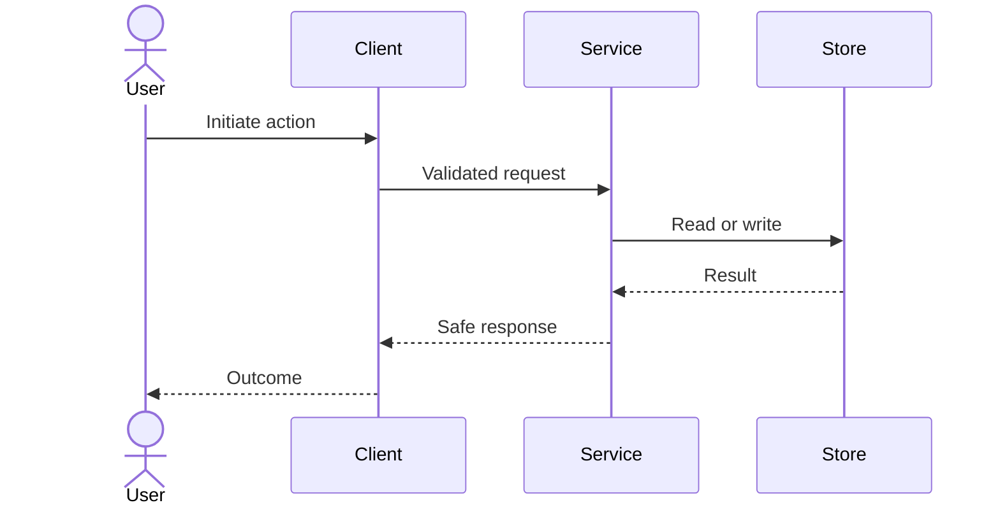
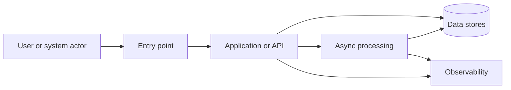
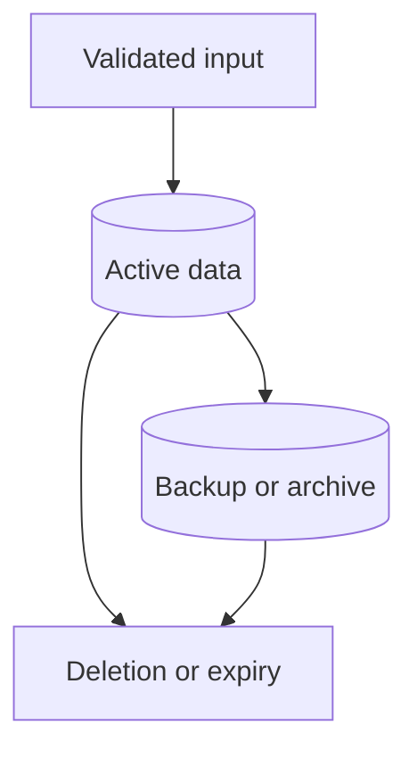
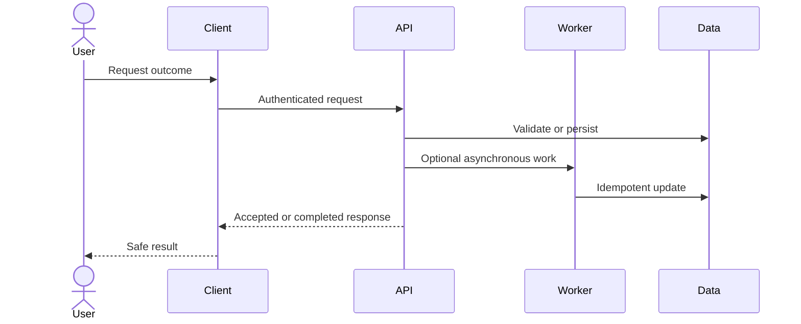
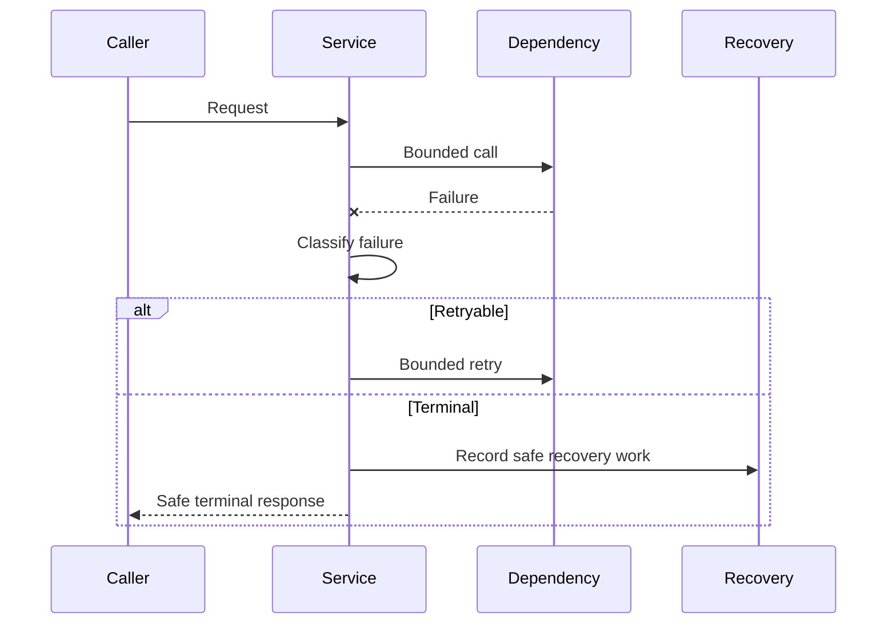

# My AWS Project — Product Requirements and Technical Design

## Document status

| Field | Value |
|---|---|
| Bootstrap release | TODO (release version and source commit/tag) |
| Workflow mode | `codex-native` |
| Project mode | `greenfield` / `brownfield` |
| Delivery profile | `quick-mvp` / `standard` / `high-risk` |
| Effective risk | `low` / `moderate` / `high` / `critical` |
| AWS lane | `documentation-only` / `read-only` / `fast-dev` / `explicit-gate` |
| Specification status | Draft |
| Current requirements revision | `REQ-0001` |
| Gate A derived status | `BLOCKED` |
| Current design revision | `DES-0001` |
| Current construction authorization ID | `AUTH-0001` |
| Gate B derived status | `BLOCKED` |
| Design status | Not started |
| Target release | TODO |
| Last reviewed | TODO |
| Primary owner | TODO |

The delivery profile controls ceremony, not safety. `quick-mvp` keeps the same
objective acceptance criteria, authorization rules, and release evidence while
favoring the smallest viable scope. Set effective risk from the actual data,
identity, external exposure, blast radius, reversibility, and regulatory impact.
If effective risk is `high` or `critical`, use the `high-risk` profile. The AWS
lane records intent only; it never grants AWS mutation authority.

Use this canonical mapping. Project lane, one prompt's access mode, and the
Gate B boundary are separate fields; do not invent synonyms.

| Project AWS lane | Prompt AWS mode | Gate B AWS boundary |
|---|---|---|
| `documentation-only` | `DOCS_ONLY` | `DOCS_ONLY` |
| `read-only` | `READ_ONLY` | `READ_ONLY` |
| `fast-dev` | `MUTATION` only after read-only preflight | `MUTATE_LISTED_RESOURCES` |
| `explicit-gate` | `DOCS_ONLY` or `READ_ONLY` | `DOCS_ONLY` or `READ_ONLY`; mutation requires a separate action-specific receipt |

`NONE` means no AWS access for the current prompt.

## 1. Workload profile

| Field | Value |
|---|---|
| Workload | My AWS Project |
| Business outcome | TODO |
| Primary owner | TODO |
| Users | TODO |
| Environment | Development / staging / production |
| AWS accounts | TODO |
| Primary Region | {{AWS_REGION}} |
| Data classification | Public / internal / confidential / regulated |
| Availability target | TODO |
| Recovery target | RTO: TODO; RPO: TODO |
| Monthly cost ceiling | {{MONTHLY_BUDGET}} |
| Expected traffic | TODO |
| Applicable AWS lenses | TODO |

### 1.1 Intake provenance

Keep the intake concise, but make every requirement traceable to a human or an
observed brownfield fact. After Gate A is approved, this repository is the
authoritative specification; Notion or chat remains provenance, not a competing
source of truth.

| Field | Value |
|---|---|
| Intake session ID | TODO |
| Intake source links | TODO (Notion page, issue, transcript, or `NONE`) |
| Participants and decision owner | TODO |
| Captured by | TODO |
| Captured at | TODO (ISO 8601 with timezone) |
| Last reconciled with sources | TODO (ISO 8601 with timezone) |
| Owner-stated outcome, in their words | TODO |
| Unresolved input IDs | TODO / `NONE` |
| Material source conflicts | TODO / `NONE` |

| Requirement or constraint ID | Basis | Source or evidence | Confidence | Owner confirmation |
|---|---|---|---|---|
| FR-001 | `OWNER_FACT` / `REPOSITORY_FACT` / `RECOMMENDATION` / `PROPOSED_ASSUMPTION` / `OPEN_QUESTION` | TODO | TODO | TODO |

Do not paste a second PRD into this section. Summarize the input, preserve links,
and translate agreed facts into the requirement sections below.

### 1.2 Brownfield baseline and preservation contract

This section is mandatory when project mode is `brownfield`. For `greenfield`,
set every field to `NOT_APPLICABLE` rather than silently leaving it blank.

| Field | Brownfield baseline |
|---|---|
| Repository and baseline commit | TODO |
| Deployed environments and observed versions | TODO |
| Existing architecture and ownership | TODO |
| Current interfaces, schemas, and consumers | TODO |
| Current data stores and migration constraints | TODO |
| Existing security and compliance controls | TODO |
| Baseline verification commands | TODO |
| Baseline evidence location | TODO |
| Known defects and accepted debt | TODO |
| Repository-to-environment drift | TODO / `NONE_OBSERVED` |
| Dirty or user-owned working-tree changes | TODO / `NONE` |
| Protected files and components | TODO |
| Unresolved bootstrap overlay collisions | TODO / `NONE` |

| Preservation ID | Behavior, asset, or constraint to preserve | How it is verified before change | Allowed change | Explicitly prohibited or approval-required change |
|---|---|---|---|---|
| PRES-001 | TODO | TODO | TODO | TODO |

Unknown brownfield behavior is not permission to replace it. If the baseline
cannot be observed, record the gap as a Gate A finding and propose the smallest
safe discovery step.

# Part I — Requirements

## 2. Product statement

Describe the product, target user, and core value in one paragraph.

## 3. Problem and opportunity

Describe:

- the problem or deficiency;
- who experiences it;
- current impact or risk;
- why it is worth solving now.

## 4. Users and outcomes

| User or actor | Desired outcome | Guardrail |
|---|---|---|
| TODO | TODO | TODO |

## 5. Goals and non-goals

### Goals

1. TODO
2. TODO
3. TODO

### Non-goals

- TODO
- TODO

## 6. Feature specifications

### User stories

| ID | User story | Priority | Related requirements |
|---|---|---|---|
| US-001 | As a TODO, I want TODO, so that TODO. | High | FR-001 |

### Functional requirements

| ID | Requirement | Acceptance criteria |
|---|---|---|
| FR-001 | TODO | Given TODO, when TODO, then TODO. |
| FR-002 | TODO | TODO |

Acceptance criteria must be objective and observable. Replace terms such as "fast," "secure," "large," or "user friendly" with measurable conditions.

## 7. Primary, alternate, and failure flows

### Primary flow



Describe the flow in numbered steps.

### Alternate flows

- TODO

### Failure and recovery flows

- TODO

## 8. Data requirements

- Authoritative stores: TODO
- Data ownership: TODO
- Classification: TODO
- Retention and deletion: TODO
- Backup and restore: TODO
- Migration and compatibility: TODO
- Data residency: TODO
- Audit data: TODO

## 9. Security and privacy requirements

| ID | Requirement | Acceptance criteria |
|---|---|---|
| SEC-001 | Protected operations require authentication. | Positive and negative authentication tests pass. |
| SEC-002 | Authorization is enforced server-side. | Cross-user and privilege-escalation properties hold. |
| SEC-003 | Secrets stay outside source control and telemetry. | Secret scans and log properties pass. |
| SEC-004 | Untrusted input is schema-validated and bounded. | Generated malformed and boundary inputs fail safely. |
| SEC-005 | IAM and trust policies follow least privilege. | Policy review and deployed access checks pass. |
| SEC-006 | Sensitive data uses approved encryption controls. | IaC and deployed configuration evidence pass. |
| SEC-007 | Security-sensitive actions are attributable. | Audit events identify actor, action, target, and time without secrets. |

Remove irrelevant rows and add workload-specific threat requirements.

## 10. Reliability requirements

| ID | Requirement | Acceptance criteria |
|---|---|---|
| REL-001 | Timeouts and retries are bounded. | Generated failure sequences never exceed configured bounds. |
| REL-002 | Duplicate work is safe where delivery may repeat. | Duplicate-input properties produce one effective outcome. |
| REL-003 | Stale or concurrent work cannot corrupt newer state. | Stateful concurrency properties hold. |
| REL-004 | Backup and recovery satisfy RTO and RPO. | Restore rehearsal evidence exists. |
| REL-005 | Releases can be rolled back safely. | Rollback rehearsal and smoke tests pass. |

## 11. Performance, cost, and sustainability requirements

### Performance efficiency

- Latency target: TODO
- Throughput or concurrency: TODO
- Scaling boundaries: TODO
- Resource limits: TODO
- Load-test profile: TODO

### Cost optimization

- Monthly ceiling: {{MONTHLY_BUDGET}}
- Budget threshold and recipients: TODO
- Primary cost drivers: TODO
- Tagging standard: TODO
- Idle-resource policy: TODO
- Teardown expectation: TODO

### Sustainability

- Remove or scale down idle resources.
- Avoid unnecessary data movement and retention.
- Measure utilization before scaling up.
- Record accepted learning-driven architecture tradeoffs.

## 12. Operational requirements

- Infrastructure as code: TODO
- Environments: TODO
- Deployment strategy: TODO
- Logging: TODO
- Metrics and dashboards: TODO
- Alarms: TODO
- Incident ownership: TODO
- Rollback: TODO
- Teardown: TODO

# Part II — Requirements Analysis and Gate A

## 13. Cross-requirement analysis

Codex must analyze the requirements as one system before completing Part III.
It may identify and propose assumptions, but it may never accept an assumption,
approve Gate A, or write an owner's authorization receipt on the owner's behalf.

### Findings

| ID | Type | Requirements involved | Finding | Resolution or decision | Blocking? | Status |
|---|---|---|---|---|---|---|
| RA-001 | Ambiguity | TODO | TODO | TODO | Yes | Open |

Valid types:

- Logical inconsistency
- Ambiguity
- Conflicting constraint
- Unstated assumption
- Missing edge case
- Missing failure behavior
- Missing concurrency behavior
- Unverifiable requirement
- Security or privacy gap
- Cost or operational gap

### Proposed assumptions

| ID | Proposed assumption | Why needed | Risk if wrong | Validation plan | Required to proceed? |
|---|---|---|---|---|---|
| ASM-001 | TODO | TODO | TODO | TODO | Yes |

Every assumption remains `PROPOSED` unless its ID is explicitly listed in the
owner acceptance record below. Silence, a prior similar decision, or an agent
recommendation is not acceptance.

### Open decisions

| ID | Decision needed | Options | Decision owner | Blocking? | Resolution |
|---|---|---|---|---|---|
| DEC-001 | TODO | TODO | TODO | Yes | TODO |

### Gate A — agent analysis record

| Field | Agent-recorded value |
|---|---|
| Requirements revision analyzed | TODO |
| Reviewed commit (optional) | TODO / `NOT_RECORDED` |
| Analysis performed by | TODO |
| Analysis completed at | TODO (ISO 8601 with timezone) |
| Open blocking finding IDs | TODO / `NONE` |
| Proposed assumption IDs required to proceed | TODO / `NONE` |
| Open blocking decision IDs | TODO / `NONE` |
| Agent recommendation | `BLOCKED` / `READY_WITH_PROPOSED_ASSUMPTIONS` / `READY_FOR_OWNER_APPROVAL` |
| Recommendation rationale | TODO |

The agent recommendation is advisory. It is not Gate A authorization.

### Gate A — owner acceptance record

| Field | Owner-provided value |
|---|---|
| Approver | TODO |
| Owner decision | `PENDING` / `CHANGES_REQUESTED` / `APPROVED` / `STALE` |
| Authorized requirements revision | TODO |
| Explicitly accepted assumption IDs | TODO / `NONE` |
| Explicitly rejected assumption IDs and resolution | TODO / `NONE` |
| Authorization provided at | TODO (ISO 8601 with timezone) |
| Authorization source | TODO (message, issue, meeting record, or commit link) |
| Verbatim owner receipt | TODO |
| Derived Gate A state | `BLOCKED` / `PENDING_OWNER_APPROVAL` / `APPROVED_FOR_DESIGN` / `STALE` |

For approval, the owner receipt must use this human-readable form with actual
values substituted:

```text
APPROVE REQUIREMENTS GATE A
Requirements revision: <REQ-nnnn>
Accepted assumptions: <assumption-IDs-or-NONE>
Approver: <name/handle>
```

Codex may ask for this receipt and record it verbatim after it is supplied. It
must not compose, infer, or mark the receipt approved for the owner.

### Gate A validation and invalidation rules

The requirements revision is a monotonic ID (`REQ-0001`, `REQ-0002`, and so on).
It covers the workflow, project mode, delivery profile, effective risk, AWS lane,
workload profile, intake provenance, brownfield contract, Parts I and II findings,
proposed assumptions, and open decisions.

Gate A is valid only when all of the following are true:

1. The current requirements revision is populated.
2. The agent analyzed that exact revision.
3. No finding or decision marked blocking remains open.
4. The agent recommendation is `READY_WITH_PROPOSED_ASSUMPTIONS` or
   `READY_FOR_OWNER_APPROVAL`.
5. The owner decision is `APPROVED` for that exact revision.
6. Every proposed assumption required to proceed is explicitly accepted by ID,
   or the requirement is revised so that the assumption is no longer needed.
7. The authorization source and verbatim owner receipt are present and agree
   with the structured fields.

Any material change to the covered content increments the requirements revision
and immediately makes **both Gate A and Gate B stale**.
Changing a finding, proposed assumption, blocking classification, or decision
after approval also makes Gate A and Gate B stale until the owner approves a
new requirements revision that incorporates the resolution. Status, timestamp,
and receipt-recording edits do not increment the revision.

# Part III — Technical Architecture and Implementation Approach

Complete this part only after Gate A is valid.

### Technical design revision record

| Field | Value |
|---|---|
| Current design revision | `DES-0001` |
| Requirements revision designed | TODO |
| Reviewed commit (optional) | TODO / `NOT_RECORDED` |
| Design prepared by | TODO |
| Design completed at | TODO (ISO 8601 with timezone) |
| Remaining design gaps | TODO / `NONE` |

The design revision is monotonic (`DES-0001`, `DES-0002`, and so on), covers
Parts III and IV, and identifies the exact Gate A-approved requirements revision
it implements.

## 14. Architecture overview



Describe:

- major components;
- trust boundaries;
- public and private network boundaries;
- identity boundaries;
- data movement;
- external dependencies;
- failure boundaries.

## 15. Component design

| Component | Responsibility | Inputs | Outputs | Dependencies | Failure behavior | Owner |
|---|---|---|---|---|---|---|
| TODO | TODO | TODO | TODO | TODO | TODO | TODO |

## 16. Interfaces and contracts

| Contract ID | Producer | Consumer | Schema or protocol | Authentication | Versioning | Idempotency |
|---|---|---|---|---|---|---|
| API-001 | TODO | TODO | TODO | TODO | TODO | TODO |

Put executable schemas in code. This section owns the architectural contract, not duplicate field-by-field definitions already enforced by schemas.

## 17. Data model and lifecycle



Define:

- entities and ownership;
- keys and indexes;
- consistency needs;
- transaction boundaries;
- retention;
- backup and restore;
- deletion semantics;
- concurrency controls.

## 18. Detailed sequence diagrams

### Sequence — primary outcome



### Sequence — failure and recovery



Add workload-specific sequences for authentication, asynchronous processing, deployment, rollback, or other complex flows.

## 19. Error handling strategy

| Error class | Example | Retry? | User-visible behavior | Logging or metric | Recovery |
|---|---|---|---|---|---|
| Validation | TODO | No | Safe 4xx or equivalent | Counter without sensitive input | User corrects request |
| Transient dependency | TODO | Bounded | Safe temporary failure | Error metric and correlation ID | Retry or queue |
| Permanent dependency | TODO | No | Reviewable terminal state | Alarm | Manual remediation |
| Concurrency conflict | TODO | No or retry with fresh state | Conflict response | Conflict metric | Re-read and retry |
| Internal defect | TODO | No uncontrolled retry | Generic safe error | Alert and trace | Rollback or fix |

Define error taxonomy, safe messages, correlation IDs, retry ownership, timeout ownership, dead-letter behavior, and operator actions.

## 20. AWS implementation approach

| Concern | Decision | AWS service or mechanism | Rationale | Tradeoff |
|---|---|---|---|---|
| Compute | TODO | TODO | TODO | TODO |
| Identity | TODO | TODO | TODO | TODO |
| Data | TODO | TODO | TODO | TODO |
| Messaging or orchestration | TODO | TODO | TODO | TODO |
| Networking | TODO | TODO | TODO | TODO |
| Observability | TODO | TODO | TODO | TODO |
| Deployment | TODO | TODO | TODO | TODO |
| Secrets and encryption | TODO | TODO | TODO | TODO |

Use the installed `aws-core` plugin from Agent Toolkit for AWS and current AWS
primary documentation when completing this section.

## 21. Implementation boundaries and order

- Existing components to reuse: TODO
- Components to modify: TODO
- Components to add: TODO
- Compatibility constraints: TODO
- Migration approach: TODO
- Feature flags or staged rollout: TODO
- Rollback boundary: TODO
- Explicitly deferred work: TODO

`TASKS.md` will translate this design into discrete executable tasks.

# Part IV — Testing Strategy

## 22. Test layers

| Layer | Purpose | Required coverage |
|---|---|---|
| Static | Formatting, linting, typing, schemas, IaC | TODO |
| Unit | Isolated rules and functions | TODO |
| Integration | Data stores, queues, identity, APIs, contracts | TODO |
| End-to-end | Complete user outcomes | TODO |
| Security | Authentication, authorization, abuse, secrets | TODO |
| Reliability | Retry, timeout, idempotency, concurrency, recovery | TODO |
| Performance | Latency, throughput, saturation, scaling | TODO |
| AWS environment | Deployed configuration and service behavior | TODO |
| Operations | Deployment, alarms, rollback, restore, teardown | TODO |

## 23. Example-based scenarios

| Test ID | Scenario | Expected result | Layer |
|---|---|---|---|
| EX-001 | Known happy path | TODO | Integration |
| EX-002 | Known boundary or failure | TODO | Unit |

## 24. Property-based testing specification

| Property ID | Requirement IDs | Invariant | Generated inputs or state | Preconditions | Oracle | Boundary or shrink focus | Layer |
|---|---|---|---|---|---|---|---|
| PROP-001 | SEC-002 | An actor never observes another actor's protected resource. | Actors, resources, roles, identifiers | Valid authenticated actors | Access allowed only when policy relation holds | Cross-tenant IDs, missing ownership, role changes | Integration |
| PROP-002 | REL-002 | Repeating the same event produces one effective state transition. | Duplicate counts, orderings, retry timing | Same idempotency identity | Final state and side effects equal one delivery | Reordered and repeated events | Integration |
| PROP-003 | SEC-003 | No generated secret appears in emitted telemetry. | Secret-like values and payload positions | Telemetry enabled | Search of logs/events contains no secret | Unicode, long values, encoded forms | Unit / integration |
| PROP-004 | REL-001 | Retry attempts never exceed the configured bound. | Failure sequences and transient/permanent classifications | Dependency fails | Attempts <= configured maximum | Zero, one, maximum, permanent transition | Unit |
| PROP-005 | TODO | TODO | TODO | TODO | TODO | TODO | TODO |

Add workload-specific properties for:

- round-trip serialization;
- parser acceptance and rejection;
- state-machine transitions;
- ordering and concurrency;
- financial calculations;
- resource-name generation;
- retention and expiry;
- access-control matrices;
- redaction;
- pagination;
- migrations.

## 25. Test data and environments

- Synthetic fixture strategy: TODO
- Generated data constraints: TODO
- Sensitive-data prohibition: TODO
- Local emulation or mocks: TODO
- AWS test environment: TODO
- Cleanup strategy: TODO
- Cost limit for tests: TODO

## 26. Release acceptance

Release is acceptable when:

- primary, alternate, and failure flows work;
- requirements-analysis blockers are resolved;
- architecture and interfaces are implemented as approved;
- required example and property-based tests pass;
- security and reliability evidence passes;
- deployment, monitoring, rollback, recovery, and cleanup are verified;
- `VERIFY.md` records the exact release decision and remaining gaps.

# Part V — Gate B: PRD and Construction Authorization

Gate B approves the complete PRD and a bounded construction run. It does not
grant authority outside the envelope below. Codex may recommend approval, but
only the decision owner may approve this gate.

## 27. Gate B agent review record

| Field | Agent-recorded value |
|---|---|
| Requirements revision reviewed | TODO |
| Design revision reviewed | TODO |
| Construction authorization ID reviewed | TODO |
| Reviewed commit (optional) | TODO / `NOT_RECORDED` |
| PRD completeness gaps | TODO / `NONE` |
| Requirement-to-design-and-test traceability gaps | TODO / `NONE` |
| Unresolved risk or preservation gaps | TODO / `NONE` |
| Review completed by and at | TODO (identity and ISO 8601 time) |
| Agent recommendation | `BLOCKED` / `READY_FOR_CONSTRUCTION_APPROVAL` |
| Recommendation rationale | TODO |

## 28. Construction envelope

Use explicit values; `reasonable`, `as needed`, and blank cells grant no
authority. `NONE` means prohibited, not undecided.

| Boundary | Authorized value |
|---|---|
| Construction authorization ID | `AUTH-0001` |
| Authorized outcome and requirement/design IDs | TODO |
| In-scope components and environments | TODO |
| Allowed repository write set | TODO (exact paths or narrow globs) |
| Excluded or owner-only write set | TODO |
| Task boundary | TODO (exact task IDs, or tasks derived only from the authorized IDs and write set) |
| Maximum generated tasks | TODO (positive integer) |
| Eligible task status | `READY` |
| Maximum parallel workers | TODO (positive integer; default `1`) |
| Parallelism rule | Disjoint write sets, dependencies, and mutable state; otherwise serialize |
| Attempt budget | TODO (maximum implementation-validation cycles per task before stopping) |
| Checkpoint cadence | TODO (at minimum after each task or safe wave) |
| Required checkpoint contents | Task status, changed paths, commands/evidence, blockers, next safe action |
| Local command boundary | TODO |
| GitHub boundary | `NONE` / `READ_ONLY` / `ISSUES` / `BRANCH_AND_PR` / `MERGE_WHEN_GREEN` |
| GitHub repository, branch, and merge constraints | TODO / `NONE` |
| AWS boundary | `NONE` / `DOCS_ONLY` / `READ_ONLY` / `MUTATE_LISTED_RESOURCES` |
| AWS account, role, Region, environment, and resources | TODO / `NONE` |
| Allowed AWS mutations and cost ceiling | TODO / `NONE` |
| Prohibited AWS actions | TODO |
| Rollback, recovery, and teardown boundary | TODO |
| Mandatory stop conditions | TODO |
| Authorization expiry or completion condition | TODO |

The task boundary may authorize later task generation without another human
gate only when every generated task traces exclusively to the approved IDs,
stays inside the allowed write and execution boundaries, and introduces no new
AWS, GitHub, security, data, cost, or preservation risk. Record the resulting
`TASKS.md` revision at the first checkpoint. Any task outside those conditions
requires a revised construction authorization and a new Gate B approval.

## 29. Gate B owner authorization record

| Field | Owner-provided value |
|---|---|
| Approver | TODO |
| Owner decision | `PENDING` / `CHANGES_REQUESTED` / `APPROVED` / `STALE` |
| Authorized requirements revision | TODO |
| Authorized design revision | TODO |
| Authorized construction authorization ID | TODO |
| Authorization provided at | TODO (ISO 8601 with timezone) |
| Authorization source | TODO (message, issue, meeting record, or commit link) |
| Verbatim owner receipt | TODO |
| Derived Gate B state | `BLOCKED` / `PENDING_OWNER_APPROVAL` / `APPROVED_FOR_CONSTRUCTION` / `STALE` |

For approval, the owner receipt must use this human-readable form with actual
values substituted:

```text
APPROVE PRD AND CONSTRUCTION GATE B
Requirements revision: <REQ-nnnn>
Design revision: <DES-nnnn>
Construction authorization: <AUTH-nnnn>
Use the proposed construction envelope above.
Approver: <name/handle>
```

Codex may record a receipt supplied by the owner; it must never create, infer,
or self-accept one.

## 30. Gate B validation and invalidation rules

The design and construction authorization use monotonic IDs (`DES-0001` and
`AUTH-0001`, then incrementing). Gate B is valid only when:

1. Gate A remains valid for the same requirements revision.
2. Parts III and IV contain no unresolved item required for the authorized
   scope, and the design revision identifies their current approved content.
3. The agent reviewed those exact requirements, design, and construction
   authorization IDs, found no blocking gap, and recommended
   `READY_FOR_CONSTRUCTION_APPROVAL`.
4. Scope, write set, task boundary, parallelism, attempt budget, checkpoints,
   GitHub authority, AWS authority, stop conditions, and expiry are explicit.
5. The owner decision is `APPROVED` for those exact revisions, and its source
   and verbatim receipt agree with the structured fields.

Any requirements change makes Gate A and Gate B `STALE`. Any design-controlled
change increments `DES`; any construction-envelope change increments `AUTH`.
Either change makes Gate B `STALE` while leaving Gate A unchanged. A revision
mismatch is stale even if a status still says `APPROVED`. Checkpoint updates,
evidence, and task status changes within the approved envelope do not invalidate
Gate B. Stop when a boundary would be exceeded, an attempt budget is exhausted,
a mandatory stop condition occurs, the authorization expires, or a gate becomes
stale; report the smallest decision needed to continue.
