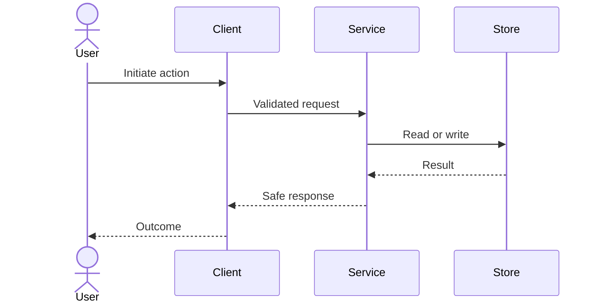
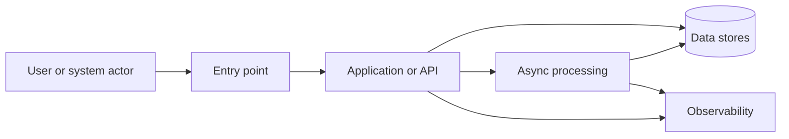
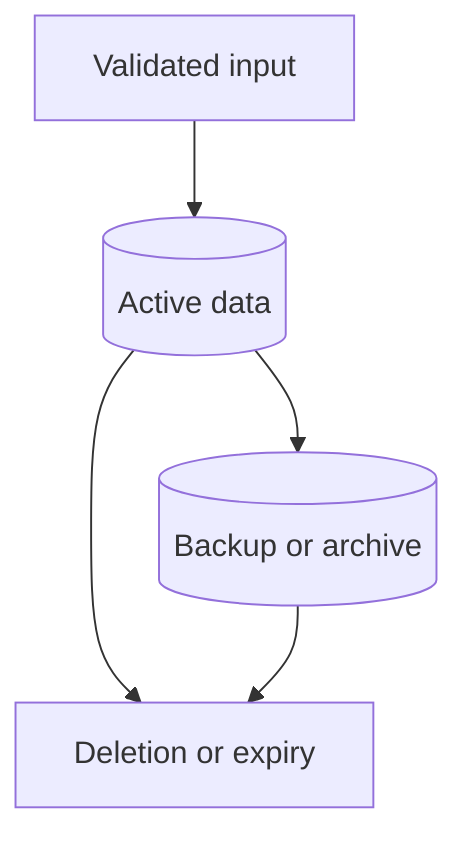
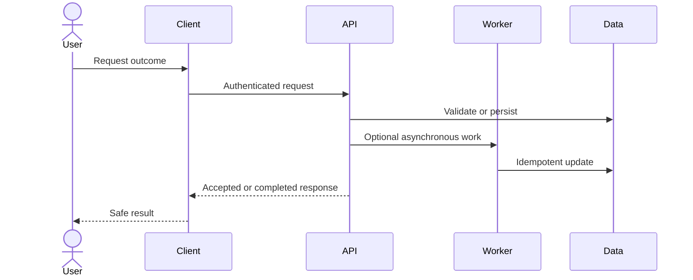
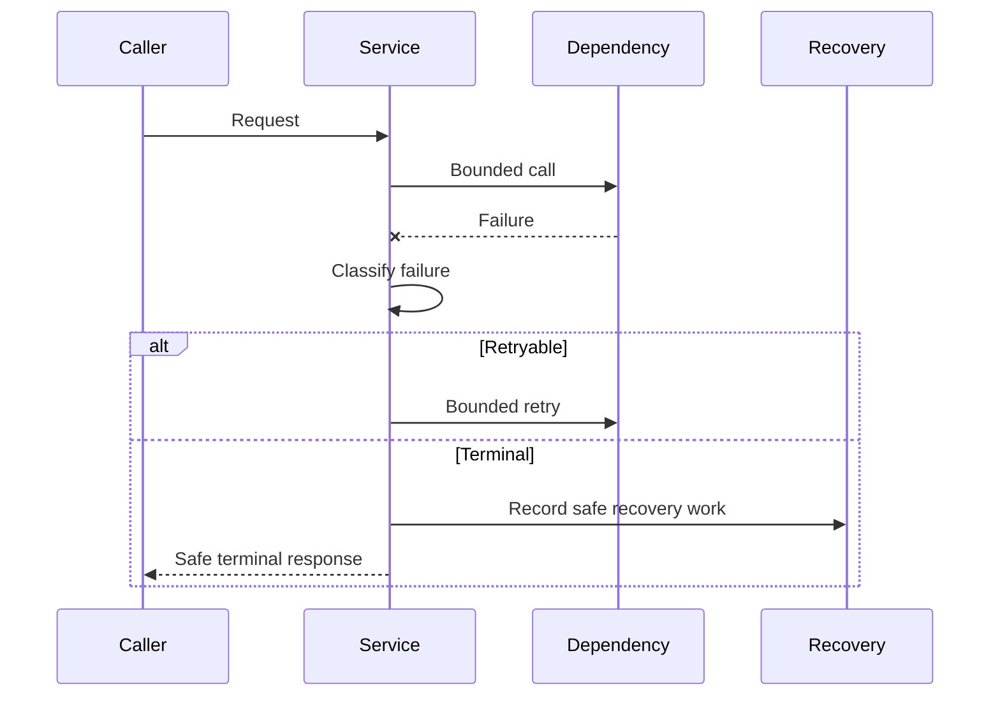

# My AWS Project — Product Requirements and Technical Design

## Document status

| Field | Value |
|---|---|
| Specification status | Draft |
| Requirements-analysis status | `BLOCKED` |
| Design status | Not started |
| Target release | TODO |
| Last reviewed | TODO |
| Approver | TODO |

## 1. Workload profile

| Field | Value |
|---|---|
| Workload | My AWS Project |
| Business outcome | TODO |
| Primary owner | TODO |
| Users | TODO |
| Environment | Development / staging / production |
| AWS accounts | TODO |
| Primary Region | {{AWS_REGION}} |
| Data classification | Public / internal / confidential / regulated |
| Availability target | TODO |
| Recovery target | RTO: TODO; RPO: TODO |
| Monthly cost ceiling | {{MONTHLY_BUDGET}} |
| Expected traffic | TODO |
| Applicable AWS lenses | TODO |

# Part I — Requirements

## 2. Product statement

Describe the product, target user, and core value in one paragraph.

## 3. Problem and opportunity

Describe:

- the problem or deficiency;
- who experiences it;
- current impact or risk;
- why it is worth solving now.

## 4. Users and outcomes

| User or actor | Desired outcome | Guardrail |
|---|---|---|
| TODO | TODO | TODO |

## 5. Goals and non-goals

### Goals

1. TODO
2. TODO
3. TODO

### Non-goals

- TODO
- TODO

## 6. Feature specifications

### User stories

| ID | User story | Priority | Related requirements |
|---|---|---|---|
| US-001 | As a TODO, I want TODO, so that TODO. | High | FR-001 |

### Functional requirements

| ID | Requirement | Acceptance criteria |
|---|---|---|
| FR-001 | TODO | Given TODO, when TODO, then TODO. |
| FR-002 | TODO | TODO |

Acceptance criteria must be objective and observable. Replace terms such as "fast," "secure," "large," or "user friendly" with measurable conditions.

## 7. Primary, alternate, and failure flows

### Primary flow

Describe the flow in numbered steps.

### Alternate flows

- TODO

### Failure and recovery flows

- TODO

## 8. Data requirements

- Authoritative stores: TODO
- Data ownership: TODO
- Classification: TODO
- Retention and deletion: TODO
- Backup and restore: TODO
- Migration and compatibility: TODO
- Data residency: TODO
- Audit data: TODO

## 9. Security and privacy requirements

| ID | Requirement | Acceptance criteria |
|---|---|---|
| SEC-001 | Protected operations require authentication. | Positive and negative authentication tests pass. |
| SEC-002 | Authorization is enforced server-side. | Cross-user and privilege-escalation properties hold. |
| SEC-003 | Secrets stay outside source control and telemetry. | Secret scans and log properties pass. |
| SEC-004 | Untrusted input is schema-validated and bounded. | Generated malformed and boundary inputs fail safely. |
| SEC-005 | IAM and trust policies follow least privilege. | Policy review and deployed access checks pass. |
| SEC-006 | Sensitive data uses approved encryption controls. | IaC and deployed configuration evidence pass. |
| SEC-007 | Security-sensitive actions are attributable. | Audit events identify actor, action, target, and time without secrets. |

Remove irrelevant rows and add workload-specific threat requirements.

## 10. Reliability requirements

| ID | Requirement | Acceptance criteria |
|---|---|---|
| REL-001 | Timeouts and retries are bounded. | Generated failure sequences never exceed configured bounds. |
| REL-002 | Duplicate work is safe where delivery may repeat. | Duplicate-input properties produce one effective outcome. |
| REL-003 | Stale or concurrent work cannot corrupt newer state. | Stateful concurrency properties hold. |
| REL-004 | Backup and recovery satisfy RTO and RPO. | Restore rehearsal evidence exists. |
| REL-005 | Releases can be rolled back safely. | Rollback rehearsal and smoke tests pass. |

## 11. Performance, cost, and sustainability requirements

### Performance efficiency

- Latency target: TODO
- Throughput or concurrency: TODO
- Scaling boundaries: TODO
- Resource limits: TODO
- Load-test profile: TODO

### Cost optimization

- Monthly ceiling: {{MONTHLY_BUDGET}}
- Budget threshold and recipients: TODO
- Primary cost drivers: TODO
- Tagging standard: TODO
- Idle-resource policy: TODO
- Teardown expectation: TODO

### Sustainability

- Remove or scale down idle resources.
- Avoid unnecessary data movement and retention.
- Measure utilization before scaling up.
- Record accepted learning-driven architecture tradeoffs.

## 12. Operational requirements

- Infrastructure as code: TODO
- Environments: TODO
- Deployment strategy: TODO
- Logging: TODO
- Metrics and dashboards: TODO
- Alarms: TODO
- Incident ownership: TODO
- Rollback: TODO
- Teardown: TODO

# Part II — Requirements Analysis Gate

## 13. Cross-requirement analysis

Codex must analyze the requirements as one system before completing Part III.

### Findings

| ID | Type | Requirements involved | Finding | Resolution or decision | Status |
|---|---|---|---|---|---|
| RA-001 | Ambiguity | TODO | TODO | TODO | Open |

Valid types:

- Logical inconsistency
- Ambiguity
- Conflicting constraint
- Unstated assumption
- Missing edge case
- Missing failure behavior
- Missing concurrency behavior
- Unverifiable requirement
- Security or privacy gap
- Cost or operational gap

### Assumptions

| ID | Assumption | Why needed | Validation plan | Accepted by |
|---|---|---|---|---|
| ASM-001 | TODO | TODO | TODO | TODO |

### Open decisions

| ID | Decision needed | Options | Decision owner | Blocking? |
|---|---|---|---|---|
| DEC-001 | TODO | TODO | TODO | Yes |

### Analysis outcome

- Status: `BLOCKED`
- Blocking findings: TODO
- Accepted assumptions: TODO
- Design may proceed: No

Allowed outcomes:

- `BLOCKED`
- `READY_WITH_ACCEPTED_ASSUMPTIONS`
- `READY_FOR_DESIGN`

# Part III — Technical Architecture and Implementation Approach

Complete this part only after the requirements-analysis gate allows design.

## 14. Architecture overview

Describe:

- major components;
- trust boundaries;
- public and private network boundaries;
- identity boundaries;
- data movement;
- external dependencies;
- failure boundaries.

## 15. Component design

| Component | Responsibility | Inputs | Outputs | Dependencies | Failure behavior | Owner |
|---|---|---|---|---|---|---|
| TODO | TODO | TODO | TODO | TODO | TODO | TODO |

## 16. Interfaces and contracts

| Contract ID | Producer | Consumer | Schema or protocol | Authentication | Versioning | Idempotency |
|---|---|---|---|---|---|---|
| API-001 | TODO | TODO | TODO | TODO | TODO | TODO |

Put executable schemas in code. This section owns the architectural contract, not duplicate field-by-field definitions already enforced by schemas.

## 17. Data model and lifecycle

Define:

- entities and ownership;
- keys and indexes;
- consistency needs;
- transaction boundaries;
- retention;
- backup and restore;
- deletion semantics;
- concurrency controls.

## 18. Detailed sequence diagrams

### Sequence — primary outcome

### Sequence — failure and recovery

Add workload-specific sequences for authentication, asynchronous processing, deployment, rollback, or other complex flows.

## 19. Error handling strategy

| Error class | Example | Retry? | User-visible behavior | Logging or metric | Recovery |
|---|---|---|---|---|---|
| Validation | TODO | No | Safe 4xx or equivalent | Counter without sensitive input | User corrects request |
| Transient dependency | TODO | Bounded | Safe temporary failure | Error metric and correlation ID | Retry or queue |
| Permanent dependency | TODO | No | Reviewable terminal state | Alarm | Manual remediation |
| Concurrency conflict | TODO | No or retry with fresh state | Conflict response | Conflict metric | Re-read and retry |
| Internal defect | TODO | No uncontrolled retry | Generic safe error | Alert and trace | Rollback or fix |

Define error taxonomy, safe messages, correlation IDs, retry ownership, timeout ownership, dead-letter behavior, and operator actions.

## 20. AWS implementation approach

| Concern | Decision | AWS service or mechanism | Rationale | Tradeoff |
|---|---|---|---|---|
| Compute | TODO | TODO | TODO | TODO |
| Identity | TODO | TODO | TODO | TODO |
| Data | TODO | TODO | TODO | TODO |
| Messaging or orchestration | TODO | TODO | TODO | TODO |
| Networking | TODO | TODO | TODO | TODO |
| Observability | TODO | TODO | TODO | TODO |
| Deployment | TODO | TODO | TODO | TODO |
| Secrets and encryption | TODO | TODO | TODO | TODO |

Use AWS MCP and current AWS primary documentation when completing this section.

## 21. Implementation boundaries and order

- Existing components to reuse: TODO
- Components to modify: TODO
- Components to add: TODO
- Compatibility constraints: TODO
- Migration approach: TODO
- Feature flags or staged rollout: TODO
- Rollback boundary: TODO
- Explicitly deferred work: TODO

`TASKS.md` will translate this design into discrete executable tasks.

# Part IV — Testing Strategy

## 22. Test layers

| Layer | Purpose | Required coverage |
|---|---|---|
| Static | Formatting, linting, typing, schemas, IaC | TODO |
| Unit | Isolated rules and functions | TODO |
| Integration | Data stores, queues, identity, APIs, contracts | TODO |
| End-to-end | Complete user outcomes | TODO |
| Security | Authentication, authorization, abuse, secrets | TODO |
| Reliability | Retry, timeout, idempotency, concurrency, recovery | TODO |
| Performance | Latency, throughput, saturation, scaling | TODO |
| AWS environment | Deployed configuration and service behavior | TODO |
| Operations | Deployment, alarms, rollback, restore, teardown | TODO |

## 23. Example-based scenarios

| Test ID | Scenario | Expected result | Layer |
|---|---|---|---|
| EX-001 | Known happy path | TODO | Integration |
| EX-002 | Known boundary or failure | TODO | Unit |

## 24. Property-based testing specification

| Property ID | Requirement IDs | Invariant | Generated inputs or state | Preconditions | Oracle | Boundary or shrink focus | Layer |
|---|---|---|---|---|---|---|---|
| PROP-001 | SEC-002 | An actor never observes another actor's protected resource. | Actors, resources, roles, identifiers | Valid authenticated actors | Access allowed only when policy relation holds | Cross-tenant IDs, missing ownership, role changes | Integration |
| PROP-002 | REL-002 | Repeating the same event produces one effective state transition. | Duplicate counts, orderings, retry timing | Same idempotency identity | Final state and side effects equal one delivery | Reordered and repeated events | Integration |
| PROP-003 | SEC-003 | No generated secret appears in emitted telemetry. | Secret-like values and payload positions | Telemetry enabled | Search of logs/events contains no secret | Unicode, long values, encoded forms | Unit / integration |
| PROP-004 | REL-001 | Retry attempts never exceed the configured bound. | Failure sequences and transient/permanent classifications | Dependency fails | Attempts <= configured maximum | Zero, one, maximum, permanent transition | Unit |
| PROP-005 | TODO | TODO | TODO | TODO | TODO | TODO | TODO |

Add workload-specific properties for:

- round-trip serialization;
- parser acceptance and rejection;
- state-machine transitions;
- ordering and concurrency;
- financial calculations;
- resource-name generation;
- retention and expiry;
- access-control matrices;
- redaction;
- pagination;
- migrations.

## 25. Test data and environments

- Synthetic fixture strategy: TODO
- Generated data constraints: TODO
- Sensitive-data prohibition: TODO
- Local emulation or mocks: TODO
- AWS test environment: TODO
- Cleanup strategy: TODO
- Cost limit for tests: TODO

## 26. Release acceptance

Release is acceptable when:

- primary, alternate, and failure flows work;
- requirements-analysis blockers are resolved;
- architecture and interfaces are implemented as approved;
- required example and property-based tests pass;
- security and reliability evidence passes;
- deployment, monitoring, rollback, recovery, and cleanup are verified;
- `VERIFY.md` records the exact release decision and remaining gaps.
